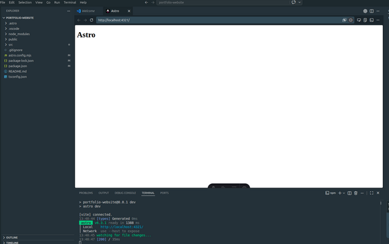

## Install Libraries and Tools

The project starts with installing the required libraries and tools. Astro is using JavaScript and Node.js, so you will need to have Node.js installed on your machine. Open the terminal and run the following command to install NodeSource depo and Node.js:

```bash
# Nodesource depo - LTS version
curl -fsSL https://deb.nodesource.com/setup_lts.x | sudo -E bash -
# Install Node.js
sudo apt-get install -y nodejs
```

<div class="callout attention">
<h4 class="callout-title">💡 Attention</h4>
<p>I am using Linux Operating System (Linux Mint Zena 22.3 LTS). So, the commands are specific to this OS. However, the sequence of steps are almost same for Mac and Windows. You should check the official Astro documentation for platform-specific instructions. For other Linux distributions, you will use different package managers (e.g., `yum` for CentOS, `pacman` for Arch Linux, `dnf` for Fedora).</p>
</div>

You can verify the installation of Node.js and npm (Node Package Manager) by running the following commands:

```bash
node -v
npm -v
```

## Initialize Astro Project

Now that you have Node.js installed, you can create a new Astro project. Run the following command in your terminal:

```bash 
# make sure you are in the home directory 
cd ~ 
npm create astro@latest portfolio-website
# it will create folder in home directory with name portfolio-website
```

This will prompt you to select a template for your Astro project. You can choose the "Minimal" template for a clean slate. After selecting the template, navigate into the project directory and open Visual Studio Code in that directory:

```bash
cd portfolio-website
code .
```

<div class="callout note">
<h4 class="callout-title">Note</h4>
<p>Install Astro extensions for Visual Studio Code to enhance your development experience.</p>
</div>

Now you have your Astro project set up and ready for development. The next step is to integrate Tailwind CSS into your Astro project, which will allow you to use utility-first CSS classes to style your website efficiently. Run the following command to install Tailwind CSS and its dependencies:

```bash
npx astro add tailwind
```

During the installation process, you will be prompted some questions about your project setup. You can choose the default options for most of the prompts, but make sure to select "Yes" when asked if you want to create a `tailwind.config.js` file, "Yes" when asked if you want to create a `postcss.config.js` file and "Yes" when asked if you want to update your `astro.config.mjs` file. These configuration files are essential for Tailwind CSS to work properly in your Astro project.

This command will automatically install Tailwind CSS and configure it for your Astro project. It will create a `tailwind.config.js` file in the root of your project, which you can customize to fit your design needs.

## Basic File Structure

After setting up Astro and Tailwind CSS, your project directory will have the following basic structure:

```
portfolio-website/
├── public/
├── src/
│   ├── components/
│   ├── layouts/
│   ├── pages/
│   └── styles/
├── tailwind.config.js
├── astro.config.mjs
├── package.json
└── node_modules/
```

- `public/`: This directory is for static assets like images, fonts, and other files that you want to serve directly. This is where you can place your profile picture and any other media you want to use on your website.
- `src/`: This is the main source directory for your Astro project. It contains all your components, layouts, pages, and styles.
  - `components/`: This directory is for reusable components that can be used across different pages of your website, such as headers, footers, and navigation bars.
  - `layouts/`: This directory is for layout components that define the overall structure of your pages, such as a main layout that includes a header and footer.
  -  `pages/`: This directory is for individual page components that represent different pages of your website, such as the home page, about page, and projects page.
  - `styles/`: This directory is for your custom CSS files. You can create a `global.css` file here to include any global styles you want to apply across your website.
- `tailwind.config.js`: This file is the configuration file for Tailwind CSS, where you can customize the default Tailwind settings, such as colors, fonts, and spacing.
- `astro.config.mjs`: This file is the configuration file for Astro, where you can set up various options for your Astro project, such as build settings, integrations, and more.
- `package.json`: This file contains the metadata for your project, including the dependencies and scripts for building and running your Astro project.
- `node_modules/`: This directory contains all the installed dependencies for your project.

With this setup, you are now ready to start building your portfolio website using Astro and Tailwind CSS. You can create your pages, components, and styles to showcase your projects and skills effectively.

After the project setup, you can run the development server to see your website in action. Use the following command in your terminal:

```bash
npm run dev
```

This will start the development server, and you can access your website by navigating to `http://localhost:4321` in your web browser. As you make changes to your files, the development server will automatically reload the page to reflect those changes, allowing you to see your updates in real-time. This is a great way to iterate quickly and see how your website is coming together as you build it. However, during the development of configuration files, it is better to stop the development server and restart it after making changes to the configuration files, as some changes may not take effect until the server is restarted. You can stop the development server by pressing `Ctrl + C` in your terminal, and then start it again with `npm run dev` after you have made your changes. 

Initially, your website will be just a blank page, but as you start adding components and styles, you will see your portfolio website take shape.  We will complete each section of the website step by step, starting with the home page, then the about page, and finally the projects page. Each section will be built using Astro components and styled with Tailwind CSS to create a visually appealing and responsive design.



## What's Next?

Till now, we have built the foundational structure of our website by setting up an Astro project and integrating Tailwind CSS.  In the next step, we will construct the Main Layout of the website. Our page, will have a top menu bar for navigation and a TOC (Table of Contents) on the right side for easy access to different sections of the page. 


