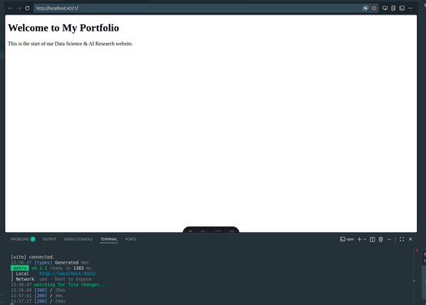
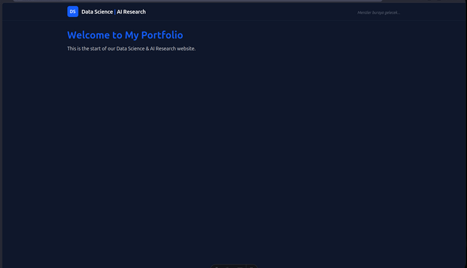
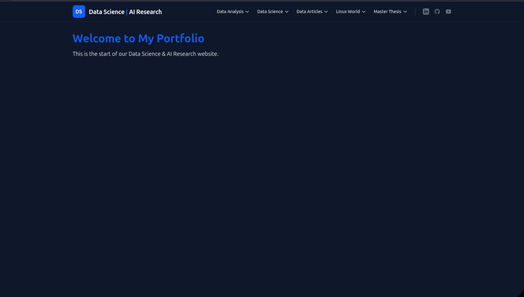

## Layout Configuration

After setting up the basic file structure of your Astro project, the next step is to configure the layout for your website. Create `MainLayout.astro` file inside the `src/layouts/` directory. In this file, we will define the main layout for our website, which will include a header, a main content area, and TOC. This layout will be used across all pages of the website to maintain a consistent design.

<details>
<summary>Click to see code</summary>

```astro
---
// 1. FRONTMATTER ALANI (Server-side JavaScript/TypeScript)
interface Props {
	title: string;
}

const { title } = Astro.props;
---

<!-- 2. HTML Skeleton -->
<!DOCTYPE html>
<html lang="en">
	<head>
		<meta charset="UTF-8" />
		<meta name="viewport" content="width=device-width" />
		<link rel="icon" type="image/svg+xml" href="/favicon.svg" />
		<title>{title} | Data Science & AI Research</title>
	</head>
	
    <!-- Configuration of background and text colors with Tailwind CSS -->
	<body class="bg-gray-50 text-gray-900 dark:bg-slate-900 dark:text-gray-100 min-h-screen flex flex-col">
		
        <!-- We Will Add Navbar Here -->

		<!-- Wide Content Area -->
		<main class="flex-grow w-full max-w-7xl mx-auto px-4 sm:px-6 lg:px-8 py-8">
			<!-- 3. SLOT: Sayfaların içeriği buraya enjekte edilecek -->
			<slot />
		</main>


	</body>
</html>
```

</details>

Explanation of the structure of `MainLayout.astro`:

- **Frontmatter Area**: This is where we define the props that our layout will accept. In this case, we are accepting a `title` prop which will be used to set the title of the page dynamically. By defining the `Interface Props`, we can ensure type safety when passing props to our layout. `Props` is an object that contains all the properties passed to the component, and we destructure it to get the `title` value. Besides the `title`, you can also add other props as needed, such as `description`, `keywords`, or any other metadata that you want to include in the head of your HTML document.

-  `<title>{title} | Data Science & AI Research</title>` This line sets the name of the page. The Data Science & AI Research part is a suffix that will be added to all page titles, while the `{title}` part will be dynamically replaced with the specific title passed as a prop when using this layout in different pages. This will be seen in the browser tab when you open the page. For example, if you pass `title="Home"` when using this layout, the browser tab will show "Home | Data Science & AI Research". This helps in improving the SEO of your website and provides a better user experience by clearly indicating the content of each page.
  
  - **HTML Skeleton**: This is the basic structure of our HTML document. We set the language to English and include meta tags for character encoding and viewport settings to ensure our website is responsive on different devices. We also link to a favicon for branding purposes.

- **Body Configuration**: We use Tailwind CSS classes to set the background color, text color, and layout of the body. The `min-h-screen` class ensures that the body takes up at least the full height of the viewport, while `flex` and `flex-col` allow us to create a flexible layout that can grow and shrink as needed.

- **Main Content Area**: The `<main>` element is where the main content of each page will be displayed. We use Tailwind CSS classes to set the maximum width, center the content, and add padding. The `<slot />` element is a placeholder that allows us to inject content from different pages into this layout. When we create individual pages, we will wrap their content in this `MainLayout` component, and the content will be rendered in place of the `<slot />` element.


## Connect Layout to Pages

The home page will be the first page we create, and it will serve as the main entry point to our website. To create the home page, create an `index.astro` file inside the `src/pages/` directory. In this file, we will use the `MainLayout` component that we just created to wrap the content of our home page.

```astro
---
import MainLayout from '../layouts/MainLayout.astro';
---

<MainLayout title="Home">
	<h1 class="text-4xl font-bold text-blue-600">Welcome to My Portfolio</h1>
	<p class="mt-4 text-lg">This is the start of our Data Science & AI Research website.</p>
</MainLayout>
```

In this code snippet, we import the `MainLayout` component and use it to wrap the content of our home page. We pass the title "Home" as a prop to the `MainLayout`, which will be used to set the title of the page in the browser tab. Inside the `MainLayout`, we have an `<h1>` element that serves as the main heading for our home page, and a `<p>` element that provides a brief introduction to our website.  

After this step, the website will look like below: 




## Content vs Pages

In Astro, the `src/content/` directory is typically used for storing markdown files or other content that can be rendered into pages, while the `src/pages/` directory is used for creating actual page components that will be rendered as part of the website. The `src/content/` directory is where you can organize your content in a way that makes sense for your project, such as by topic or category. You can then create pages in the `src/pages/` directory that import and render this content as needed. This separation allows for better organization and maintainability of your project, as you can keep your content and page components separate while still being able to easily access and render your content within your pages.

**Why Home Page is Created in `src/pages/` Instead of `src/content/`?**

We created the home page in the `src/pages/` directory because it is an actual page component that will be rendered as part of the website. The home page serves as the main entry point to our website and is a crucial part of the user experience. It is not just content that can be rendered into a page, but rather a full page component that includes layout, styling, and interactivity. By placing it in the `src/pages/` directory, we can ensure that it is treated as a page component and can be easily accessed and rendered by Astro when users navigate to the home page of our website.

If we put it in the `src/content/` directory, it would be treated as content that needs to be rendered into a page, which is not the case for the home page. The home page is a standalone page that should be directly accessible via its URL, and it should have its own layout and styling. Therefore, it is more appropriate to create it in the `src/pages/` directory where it can be treated as a full page component rather than just content to be rendered.

However, you can create other pages in the `src/pages/` directory that import and render content from the `src/content/` directory as needed. For example, you could create an "About" page in the `src/pages/` directory that imports markdown content from the `src/content/` directory to display information about yourself or your projects. This way, you can keep your content organized in the `src/content/` directory while still being able to create full page components in the `src/pages/` directory that render this content effectively.

<div class = "callout note">
<h4 class="callout-title">Pages are Bridge between Markdown and Astro</h4>
<p>Pages in the <b>src/pages/</b> directory act as a bridge between the content in the <b>src/content/</b> directory and the layout defined in the <b>src/layouts/</b> directory. They allow you to take content from the <b>src/content/</b> directory as raw markdown format and render it within the layout defined in the <b>src/layouts/</b> directory written in Astro's syntax, creating a cohesive and well-structured website.</p>
</div>


## Navigation Bar (Navbar)

After successfully setting up the layout and creating the home page, the next step is to create a navigation bar (navbar) for our website. The navbar will allow users to easily navigate between different pages and sections of our website. We will create a `Navbar.astro` component that will be included in our `MainLayout.astro` so that it appears on all pages of the website.

To create the `Navbar.astro` component, create a new file named `Navbar.astro` inside the `src/components/` directory. In this file, we will define the structure and styling of our navigation bar using Astro's syntax and Tailwind CSS for styling.


<details>
<summary>Click to see code</summary>

```astro
---
// Navbar.astro (Top Navigation Bar)
---

<nav class="bg-white/80 dark:bg-slate-900/80 backdrop-blur-md border-b border-gray-200 dark:border-slate-800 sticky top-0 z-50">
  <div class="max-w-7xl mx-auto px-4 sm:px-6 lg:px-8">
    <div class="flex justify-between items-center h-16">
      
      <!-- Website Name and Logo-->
      <div class="flex items-center gap-3">
        <!-- Logo Placeholder-->
        <div class="w-10 h-10 bg-blue-600 rounded-lg flex items-center justify-center text-white font-bold">
          DS
        </div>
        <!-- Website Name -->
        <a href="/" class="text-xl font-bold text-gray-900 dark:text-white tracking-tight">
          Data Science <span class="text-blue-600">|</span> AI Research
        </a>
      </div>

      <!-- Middle Section: Dropdown Menus (We will fill this in the next step) -->
      <div class="hidden md:flex space-x-8">
         <span class="text-gray-500 italic text-sm mt-2">Menus will go here...</span>
      </div>

    </div>
  </div>
</nav>
```

</details>

After writing the code for the `Navbar.astro` component, we need to include it in our `MainLayout.astro` so that it appears on all pages of the website. To do this, we will import the `Navbar` component at the top of our `MainLayout.astro` file and then include it in the body of our layout. Paste the following code into the frontmatter area  (between `---` lines) of `MainLayout.astro` to import the `Navbar` component:

<details>
<summary>Click to see code</summary>

```astro
---
import '../styles/global.css';
import Navbar from '../components/Navbar.astro';
   
interface Props {
    title: string;
}
   
const { title } = Astro.props;
---
```

</details>

Then add the `<Navbar />` component inside the body of `MainLayout.astro`, right before the `<main>` element, like this:

<details>
<summary>Click to see code</summary>

```astro
<body class="bg-gray-50 text-gray-900 dark:bg-slate-900 dark:text-gray-100 min-h-screen flex flex-col">
       
       <!-- Navbar Bileşenini Buraya Ekledik -->
       <Navbar/>

       <!-- Ana içerik alanı -->
       <main class="flex-grow w-full max-w-7xl mx-auto px-4 sm:px-6 lg:px-8 py-8">
           <slot />
       </main>

   </body>
```

</details>

If your page seems blank again without any content, just navigate to the `src/styles/global.css` file and add the following line at the top of the file to ensure that Tailwind CSS styles are applied correctly:

```css
@import "tailwindcss";
```

After these steps, run `npm run dev` again to start the development server, and you should see the navigation bar at the top of your home page with the website name and logo. The middle section of the navbar will be empty for now, but we will fill it with dropdown menus in the next step.



Now we have successfully set up the layout for our Astro project and created a navigation bar that will be displayed on all pages of our website. In the next step, we will focus on adding dropdown menus to the navbar to allow users to navigate to different sections of our website more easily.


## Dropdown Menus on Navbar

To add dropdown menus to our navbar, we will first need to define the structure of our dropdown menus in the `Navbar.astro` component. The syntax is very logical. Replace the whole code in `Navbar.astro` with the following code to implement dropdown menus:

<details>
<summary>Click to see code</summary>

```astro
---
// Navbar.astro (Top Navigation Bar)

// Define the structure of the dropdown menus as an array of objects. 
// You will configure this part if you want to add or remove any menu items or links in the future.
const menuItems = [
  {
    title: "Data Analysis",
    links: [
      { name: "Advanced SQL & Tableau Project", url: "/data-analysis/sql-tableau" },
      { name: "DuckDB SQL & ML & Prediction", url: "/data-analysis/duckdb" },
      { name: "Analysis & Prediction of Credit Default", url: "/data-analysis/credit-default" }
    ]
  },
  {
    title: "Data Science",
    links: [
      { name: "Churn Prediction Pipeline", url: "/data-science/churn-prediction" },
      { name: "Plotly Dash Mastery Course", url: "/data-science/plotly-dash" }
    ]
  },
  {
    title: "Data Articles",
    links: [
      { name: "Statistics", url: "/articles/statistics" },
      { name: "SQL", url: "/articles/sql" },
      { name: "Machine Learning", url: "/articles/machine-learning" },
      { name: "Neural Network", url: "/articles/neural-network" },
      { name: "Cloud Technologies", url: "/articles/cloud" },
      { name: "Software & Hardware", url: "/articles/software-hardware" },
      { name: "AI Research", url: "/articles/ai-research" }
    ]
  },
  {
    title: "Linux World",
    links: [
      { name: "Application Setups in Linux", url: "/linux-world/setups" },
      { name: "Technical Articles in Linux", url: "/linux-world/articles" }
    ]
  },
  {
    title: "Master Thesis",
    links: [
      { name: "Description", url: "/master-thesis/description" },
      { name: "Progress", url: "/master-thesis/progress" }
    ]
  }
];
---

<nav class="bg-white/80 dark:bg-slate-900/80 backdrop-blur-md border-b border-gray-200 dark:border-slate-800 sticky top-0 z-50">
  <div class="max-w-7xl mx-auto px-4 sm:px-6 lg:px-8">
    <div class="flex justify-between items-center h-16">
      
      <!-- Left: Logo & Site Name -->
      <div class="flex items-center gap-3">
        <div class="w-10 h-10 bg-blue-600 rounded-lg flex items-center justify-center text-white font-bold">
          DS
        </div>
        <a href="/" class="text-xl font-bold text-gray-900 dark:text-white tracking-tight">
          Data Science <span class="text-blue-600">|</span> AI Research
        </a>
      </div>

      <!-- Right: Desktop Navigation & Socials -->
      <div class="hidden lg:flex items-center gap-6">
        
        <!-- Navigation Menus -->
        <div class="flex items-center space-x-6">
          {menuItems.map((menu) => (
            <div class="relative group py-4">
              <a href={`/${menu.title.toLowerCase().replace(' ', '-')}`} class="flex items-center gap-1 text-sm font-medium text-gray-700 dark:text-gray-200 hover:text-blue-600 dark:hover:text-blue-400 transition-colors cursor-pointer">
                {menu.title}
                <svg class="w-4 h-4" fill="none" stroke="currentColor" viewBox="0 0 24 24" xmlns="http://www.w3.org/2000/svg"><path stroke-linecap="round" stroke-linejoin="round" stroke-width="2" d="M19 9l-7 7-7-7"></path></svg>
              </a>
              <div class="absolute left-0 top-full mt-[-8px] w-64 rounded-md shadow-lg bg-white dark:bg-slate-800 ring-1 ring-black ring-opacity-5 opacity-0 invisible group-hover:opacity-100 group-hover:visible transition-all duration-200 ease-in-out transform origin-top-left z-50">
                <div class="py-2" role="menu" aria-orientation="vertical">
                  {menu.links.map((link) => (
                    <a href={link.url} class="block px-4 py-2 text-sm text-gray-700 dark:text-gray-300 hover:bg-gray-100 dark:hover:bg-slate-700 hover:text-blue-600 dark:hover:text-blue-400 transition-colors" role="menuitem">
                      {link.name}
                    </a>
                  ))}
                </div>
              </div>
            </div>
          ))}
        </div>

        <!-- Vertical Divider (Menü ile ikonları şıkça ayırır) -->
        <div class="h-6 w-px bg-gray-300 dark:bg-slate-700"></div>

        <!-- Social Icons -->
        <div class="flex items-center gap-4">
          
          <!-- LinkedIn -->
          <a href="https://www.linkedin.com/in/vasif-asadov1/" target="_blank" rel="noopener noreferrer" class="text-gray-500 hover:text-[#0a66c2] dark:hover:text-[#0a66c2] transition-colors" aria-label="LinkedIn">
            <svg class="w-5 h-5" fill="currentColor" viewBox="0 0 24 24" aria-hidden="true">
              <path fill-rule="evenodd" d="M19 0h-14c-2.761 0-5 2.239-5 5v14c0 2.761 2.239 5 5 5h14c2.762 0 5-2.239 5-5v-14c0-2.761-2.238-5-5-5zm-11 19h-3v-11h3v11zm-1.5-12.268c-.966 0-1.75-.79-1.75-1.764s.784-1.764 1.75-1.764 1.75.79 1.75 1.764-.783 1.764-1.75 1.764zm13.5 12.268h-3v-5.604c0-3.368-4-3.113-4 0v5.604h-3v-11h3v1.765c1.396-2.586 7-2.777 7 2.476v6.759z" clip-rule="evenodd" />
            </svg>
          </a>

          <!-- GitHub -->
          <a href="https://github.com/vasif-asadov1" target="_blank" rel="noopener noreferrer" class="text-gray-500 hover:text-gray-900 dark:hover:text-white transition-colors" aria-label="GitHub">
            <svg class="w-5 h-5" fill="currentColor" viewBox="0 0 24 24" aria-hidden="true">
              <path fill-rule="evenodd" d="M12 2C6.477 2 2 6.484 2 12.017c0 4.425 2.865 8.18 6.839 9.504.5.092.682-.217.682-.483 0-.237-.008-.868-.013-1.703-2.782.605-3.369-1.343-3.369-1.343-.454-1.158-1.11-1.466-1.11-1.466-.908-.62.069-.608.069-.608 1.003.07 1.531 1.032 1.531 1.032.892 1.53 2.341 1.088 2.91.832.092-.647.35-1.088.636-1.338-2.22-.253-4.555-1.113-4.555-4.951 0-1.093.39-1.988 1.029-2.688-.103-.253-.446-1.272.098-2.65 0 0 .84-.27 2.75 1.026A9.564 9.564 0 0112 6.844c.85.004 1.705.115 2.504.337 1.909-1.296 2.747-1.027 2.747-1.027.546 1.379.202 2.398.1 2.651.64.7 1.028 1.595 1.028 2.688 0 3.848-2.339 4.695-4.566 4.943.359.309.678.92.678 1.855 0 1.338-.012 2.419-.012 2.747 0 .268.18.58.688.482A10.019 10.019 0 0022 12.017C22 6.484 17.522 2 12 2z" clip-rule="evenodd" />
            </svg>
          </a>

          <!-- YouTube -->
          <a href="https://www.youtube.com/@data_insights_vasif" target="_blank" rel="noopener noreferrer" class="text-gray-500 hover:text-[#ff0000] dark:hover:text-[#ff0000] transition-colors" aria-label="YouTube">
            <svg class="w-5 h-5" fill="currentColor" viewBox="0 0 24 24" aria-hidden="true">
              <path fill-rule="evenodd" d="M21.582 6.186a2.665 2.665 0 0 0-1.876-1.889C17.95 3.8 12 3.8 12 3.8s-5.95 0-7.706.497A2.665 2.665 0 0 0 2.418 6.186C2 7.953 2 12 2 12s0 4.047.418 5.814a2.665 2.665 0 0 0 1.876 1.889C6.05 20.2 12 20.2 12 20.2s5.95 0 7.706-.497a2.665 2.665 0 0 0 1.876-1.889C22 15.953 22 12 22 12s0-4.047-.418-5.814zM9.9 15.556V8.444L15.9 12l-6 3.556z" clip-rule="evenodd" />
            </svg>
          </a>

        </div>
      </div>

    </div>
  </div>
</nav>
```

</details>


In this code snippet, we have defined the top menu bar with the following elements:

- **Logo & Site Name**: On the left side of the navbar, we have a logo placeholder (a blue square with "DS" text) and the website name "Data Science | AI Research". The website name is a link that directs users back to the home page when clicked
- **Dropdown Menus**: In the middle section of the navbar, we have implemented dropdown menus for different categories such as "Data Analysis", "Data Science", "Data Articles", "Linux World", and "Master Thesis". Each category has its own set of links that will be displayed when the user hovers over the category name. The dropdown menus are created using a combination of Tailwind CSS classes and Astro's syntax to loop through the `menuItems` array and generate the appropriate HTML structure for each menu and its links.
- **Social Icons**: On the right side of the navbar, we have added social media icons for LinkedIn, GitHub, and YouTube. Each icon is a link that directs users to the respective social media profiles when clicked. The icons are styled with Tailwind CSS to change color on hover, providing a visual cue to users that they are clickable.


After implementing the dropdown menus in the `Navbar.astro` component and including it in our `MainLayout.astro`, you can run `npm run dev` again to see the changes in your development server. When you hover over the menu items in the navbar, you should see the dropdown menus appear with the respective links. You can click on these links to navigate to different sections of your website (though you will need to create those pages and content for the links to work properly). The social media icons should also be visible on the right side of the navbar, allowing users to easily access your LinkedIn, GitHub, and YouTube profiles.




## What We Achieved in This Section?

In this section, we have successfully configured the layout for our Astro project by creating a `MainLayout.astro` component that defines the structure of our pages and includes a navigation bar (navbar) at the top. We also created a `Navbar.astro` component that contains dropdown menus for different categories and social media icons. By including the `Navbar` component in our `MainLayout`, we ensured that the navbar will be displayed on all pages of our website, providing a consistent and user-friendly navigation experience for visitors. In the next sections, we will focus on creating individual pages and content for our website, as well as further customizing the design and functionality of our site.


## What's Next?

In the next section, we will write the content of our home page and create additional pages for our website. We will also learn how to use markdown files to manage our content and render it within our Astro pages. This will allow us to easily create and organize our content while maintaining a consistent layout and design across all pages of our website. 


