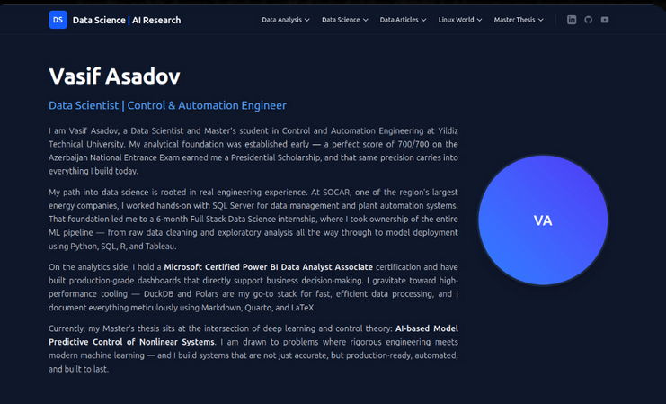

## Home Page Content 

After successfully configuring the layout of our Astro project in the previous section, we will now focus on writing the content for our home page. The home page will serve as an introduction to our portfolio website, providing visitors with an overview of who we are, our skills, and the projects we have worked on. 

For my website, I will write my information (profile summary, education, experience, skills, and projects) in the `src/pages/index.astro` file. This file will be the main entry point for our home page content. We will use HTML and Astro components to structure the content and make it visually appealing.

You can copy paste the following code into your `src/pages/index.astro` file to create a basic home page layout with sections for profile summary, education, experience, skills, and projects. Then you will delete and fill the content with your information.


<details> 
<summary>Click to view the code for the home page content</summary>

```astro
---
import MainLayout from '../layouts/MainLayout.astro';
---

<MainLayout title="Home">
  
  <section class="flex flex-col-reverse md:flex-row gap-10 items-center mb-20 mt-8">
    <div class="flex-1 space-y-6">
      <h1 class="text-4xl md:text-5xl font-extrabold text-gray-900 dark:text-white tracking-tight">
        Vasif Asadov
      </h1>
      <h2 class="text-xl md:text-2xl font-medium text-blue-600 dark:text-blue-400">
        Data Scientist | Control & Automation Engineer
      </h2>
      <div class="text-gray-600 dark:text-gray-300 space-y-4 text-base md:text-lg leading-relaxed text-justify">
        <p>
          I am Vasif Asadov, a Data Scientist and Master's student in Control and Automation Engineering at Yildiz Technical University. My analytical foundation was established early — a perfect score of 700/700 on the Azerbaijan National Entrance Exam earned me a Presidential Scholarship, and that same precision carries into everything I build today.
        </p>
        <p>
          My path into data science is rooted in real engineering experience. At SOCAR, one of the region's largest energy companies, I worked hands-on with SQL Server for data management and plant automation systems. That foundation led me to a 6-month Full Stack Data Science internship, where I took ownership of the entire ML pipeline — from raw data cleaning and exploratory analysis all the way through to model deployment using Python, SQL, R, and Tableau.
        </p>
        <p>
          On the analytics side, I hold a <strong class="text-gray-900 dark:text-gray-100">Microsoft Certified Power BI Data Analyst Associate</strong> certification and have built production-grade dashboards that directly support business decision-making. I gravitate toward high-performance tooling — DuckDB and Polars are my go-to stack for fast, efficient data processing, and I document everything meticulously using Markdown, Quarto, and LaTeX.
        </p>
        <p>
          Currently, my Master's thesis sits at the intersection of deep learning and control theory: <strong class="text-gray-900 dark:text-gray-100">AI-based Model Predictive Control of Nonlinear Systems</strong>. I am drawn to problems where rigorous engineering meets modern machine learning — and I build systems that are not just accurate, but production-ready, automated, and built to last.
        </p>
      </div>
    </div>
    
    <div class="w-48 h-48 md:w-72 md:h-72 shrink-0 rounded-full overflow-hidden border-4 border-white dark:border-slate-800 shadow-xl">
      <div class="w-full h-full bg-gradient-to-tr from-blue-500 to-indigo-600 flex items-center justify-center text-white text-3xl font-bold">
        VA
      </div>
      </div>
  </section>

  <section class="grid grid-cols-1 lg:grid-cols-2 gap-12 mb-20">
    
    <div>
      <h3 class="text-2xl font-bold text-gray-900 dark:text-white mb-6 border-b-2 border-blue-600 inline-block pb-1">Experience</h3>
      <div class="space-y-6">
        
        <div class="bg-white dark:bg-slate-800 p-6 rounded-xl shadow-sm border border-gray-100 dark:border-slate-700">
          <div class="flex justify-between items-start mb-2">
            <div>
              <h4 class="text-lg font-bold text-gray-900 dark:text-white">Data Scientist Intern</h4>
              <p class="text-blue-600 dark:text-blue-400 font-medium">Data Science Academy | Remote</p>
            </div>
            <span class="text-sm text-gray-500 dark:text-gray-400 bg-gray-100 dark:bg-slate-700 px-3 py-1 rounded-full whitespace-nowrap">Jul 2025 - Jan 2026</span>
          </div>
          <ul class="list-disc list-outside ml-5 mt-4 space-y-2 text-sm text-gray-600 dark:text-gray-300">
            <li>Conducted exploratory data analysis and advanced preprocessing on structured datasets, engineering predictive features for end-to-end machine learning workflows.</li>
            <li>Built and optimized machine learning models using Python and Scikit-Learn, applying cross-validation, hyperparameter tuning, and performance metrics to improve generalization.</li>
            <li>Performed statistical analysis and hypothesis testing to validate model assumptions and communicated results through visualizations and technical reports.</li>
            <li>Developed interactive Power BI and Tableau dashboards to present model outputs and business KPIs to stakeholders.</li>
          </ul>
        </div>

        <div class="bg-white dark:bg-slate-800 p-6 rounded-xl shadow-sm border border-gray-100 dark:border-slate-700">
          <div class="flex justify-between items-start mb-2">
            <div>
              <h4 class="text-lg font-bold text-gray-900 dark:text-white">Data Management Intern</h4>
              <p class="text-blue-600 dark:text-blue-400 font-medium">R&D Institute of Oil and Gas (SOCAR) | Baku</p>
            </div>
            <span class="text-sm text-gray-500 dark:text-gray-400 bg-gray-100 dark:bg-slate-700 px-3 py-1 rounded-full whitespace-nowrap">Mar 2023 - May 2023</span>
          </div>
          <ul class="list-disc list-outside ml-5 mt-4 space-y-2 text-sm text-gray-600 dark:text-gray-300">
            <li>Managed, validated, and optimized plant sensor data in Microsoft SQL Server, ensuring data accuracy, availability, and efficient storage and retrieval of industrial datasets.</li>
            <li>Developed automated SQL triggers for threshold-based alerts, supporting reporting workflows by maintaining clean, reliable operational data to improve monitoring efficiency.</li>
          </ul>
        </div>

      </div>
    </div>

    <div>
      <h3 class="text-2xl font-bold text-gray-900 dark:text-white mb-6 border-b-2 border-blue-600 inline-block pb-1">Education</h3>
      <div class="space-y-6">
        
        <div class="bg-white dark:bg-slate-800 p-6 rounded-xl shadow-sm border border-gray-100 dark:border-slate-700">
          <h4 class="text-lg font-bold text-gray-900 dark:text-white">Master's Degree - Control & Automation Eng.</h4>
          <p class="text-blue-600 dark:text-blue-400 font-medium">Yildiz Technical University | Istanbul, Türkiye</p>
          <ul class="list-disc list-outside ml-5 mt-4 space-y-2 text-sm text-gray-600 dark:text-gray-300">
            <li>Fully Funded Türkiye Scholarship for Master Education.</li>
            <li>Thesis: Deep Learning Based Model Predictive Control of Nonlinear Systems.</li>
          </ul>
        </div>

        <div class="bg-white dark:bg-slate-800 p-6 rounded-xl shadow-sm border border-gray-100 dark:border-slate-700">
          <div class="flex justify-between items-start mb-2">
            <div>
              <h4 class="text-lg font-bold text-gray-900 dark:text-white">Bachelor's Degree - Process Automation Eng.</h4>
              <p class="text-blue-600 dark:text-blue-400 font-medium">Baku Higher Oil School | Baku, Azerbaijan</p>
            </div>
            <span class="text-sm text-gray-500 dark:text-gray-400 bg-gray-100 dark:bg-slate-700 px-3 py-1 rounded-full whitespace-nowrap">Sep 2018 - Jun 2023</span>
          </div>
          <ul class="list-disc list-outside ml-5 mt-4 space-y-2 text-sm text-gray-600 dark:text-gray-300">
            <li>Azerbaijan Presidency Scholarship for Bachelor Education.</li>
            <li>Graduated with GPA: 3.5/4.0.</li>
          </ul>
        </div>

      </div>
    </div>

  </section>

  <section class="mb-20">
    <h3 class="text-2xl font-bold text-gray-900 dark:text-white mb-6 border-b-2 border-blue-600 inline-block pb-1">Technical Skills</h3>
    <div class="grid grid-cols-1 md:grid-cols-2 gap-8">
      
      <div class="bg-gray-50 dark:bg-slate-800/50 p-6 rounded-xl">
        <h4 class="font-bold text-gray-800 dark:text-gray-200 mb-4">Programming</h4>
        <div class="flex flex-wrap gap-2">
          <span class="px-3 py-1 bg-blue-100 text-blue-800 dark:bg-blue-900 dark:text-blue-200 text-sm font-medium rounded-md">Python (Pandas, NumPy, Scikit-Learn, PySpark)</span>
          <span class="px-3 py-1 bg-blue-100 text-blue-800 dark:bg-blue-900 dark:text-blue-200 text-sm font-medium rounded-md">R (tidyverse, data.table, shiny)</span>
          <span class="px-3 py-1 bg-blue-100 text-blue-800 dark:bg-blue-900 dark:text-blue-200 text-sm font-medium rounded-md">LaTeX</span>
        </div>
      </div>

      <div class="bg-gray-50 dark:bg-slate-800/50 p-6 rounded-xl">
        <h4 class="font-bold text-gray-800 dark:text-gray-200 mb-4">Machine Learning</h4>
        <div class="flex flex-wrap gap-2">
          <span class="px-3 py-1 bg-emerald-100 text-emerald-800 dark:bg-emerald-900 dark:text-emerald-200 text-sm font-medium rounded-md">Supervised/Unsupervised</span>
          <span class="px-3 py-1 bg-emerald-100 text-emerald-800 dark:bg-emerald-900 dark:text-emerald-200 text-sm font-medium rounded-md">Regression & Classification</span>
          <span class="px-3 py-1 bg-emerald-100 text-emerald-800 dark:bg-emerald-900 dark:text-emerald-200 text-sm font-medium rounded-md">XGBoost & LightGBM</span>
          <span class="px-3 py-1 bg-emerald-100 text-emerald-800 dark:bg-emerald-900 dark:text-emerald-200 text-sm font-medium rounded-md">SHAP & WOE Encoding</span>
        </div>
      </div>

      <div class="bg-gray-50 dark:bg-slate-800/50 p-6 rounded-xl">
        <h4 class="font-bold text-gray-800 dark:text-gray-200 mb-4">Databases</h4>
        <div class="flex flex-wrap gap-2">
          <span class="px-3 py-1 bg-purple-100 text-purple-800 dark:bg-purple-900 dark:text-purple-200 text-sm font-medium rounded-md">MS SQL Server</span>
          <span class="px-3 py-1 bg-purple-100 text-purple-800 dark:bg-purple-900 dark:text-purple-200 text-sm font-medium rounded-md">PostgreSQL & MySQL</span>
          <span class="px-3 py-1 bg-purple-100 text-purple-800 dark:bg-purple-900 dark:text-purple-200 text-sm font-medium rounded-md">Oracle (PL/SQL)</span>
          <span class="px-3 py-1 bg-purple-100 text-purple-800 dark:bg-purple-900 dark:text-purple-200 text-sm font-medium rounded-md">DuckDB</span>
        </div>
      </div>

      <div class="bg-gray-50 dark:bg-slate-800/50 p-6 rounded-xl">
        <h4 class="font-bold text-gray-800 dark:text-gray-200 mb-4">BI, Visualization & Cloud</h4>
        <div class="flex flex-wrap gap-2">
          <span class="px-3 py-1 bg-amber-100 text-amber-800 dark:bg-amber-900 dark:text-amber-200 text-sm font-medium rounded-md">Power BI & Tableau</span>
          <span class="px-3 py-1 bg-amber-100 text-amber-800 dark:bg-amber-900 dark:text-amber-200 text-sm font-medium rounded-md">Plotly</span>
          <span class="px-3 py-1 bg-amber-100 text-amber-800 dark:bg-amber-900 dark:text-amber-200 text-sm font-medium rounded-md">AWS & Snowflake</span>
          <span class="px-3 py-1 bg-amber-100 text-amber-800 dark:bg-amber-900 dark:text-amber-200 text-sm font-medium rounded-md">Git & Docker</span>
        </div>
      </div>

    </div>
  </section>

  <section class="mb-20">
    <h3 class="text-2xl font-bold text-gray-900 dark:text-white mb-6 border-b-2 border-blue-600 inline-block pb-1">Certifications</h3>
    <div class="grid grid-cols-1 md:grid-cols-2 lg:grid-cols-3 gap-6">
      
      <a href="/certificates/ms_powerbi.pdf" target="_blank" class="block p-6 bg-indigo-50/50 dark:bg-indigo-900/10 border border-indigo-100 dark:border-indigo-800/50 rounded-xl hover:shadow-md hover:border-indigo-300 dark:hover:border-indigo-500 transition-all group">
        <strong class="block text-lg text-indigo-700 dark:text-indigo-400 group-hover:text-indigo-600 mb-1">Microsoft Certified: Power BI Analyst</strong>
        <span class="text-sm text-gray-500 dark:text-gray-400">PL-300 Associate Certificate</span>
      </a>

      <a href="/certificates/data_science_academy_certificate.pdf" target="_blank" class="block p-6 bg-indigo-50/50 dark:bg-indigo-900/10 border border-indigo-100 dark:border-indigo-800/50 rounded-xl hover:shadow-md hover:border-indigo-300 dark:hover:border-indigo-500 transition-all group">
        <strong class="block text-lg text-indigo-700 dark:text-indigo-400 group-hover:text-indigo-600 mb-1">Full Stack Data Scientist</strong>
        <span class="text-sm text-gray-500 dark:text-gray-400">Data Science Academy Certificate</span>
      </a>

      <a href="/certificates/talent_report_snapshot.pdf" target="_blank" class="block p-6 bg-emerald-50/50 dark:bg-emerald-900/10 border border-emerald-100 dark:border-emerald-800/50 rounded-xl hover:shadow-md hover:border-emerald-300 dark:hover:border-emerald-500 transition-all group">
        <strong class="block text-lg text-emerald-700 dark:text-emerald-400 group-hover:text-emerald-600 mb-1">Talent Report Snapshot</strong>
        <span class="text-sm text-gray-500 dark:text-gray-400">One-Page Performance Summary</span>
      </a>

      <a href="/certificates/vasif_asadov_talent_report.pdf" target="_blank" class="block p-6 bg-indigo-50/50 dark:bg-indigo-900/10 border border-indigo-100 dark:border-indigo-800/50 rounded-xl hover:shadow-md hover:border-indigo-300 dark:hover:border-indigo-500 transition-all group">
        <strong class="block text-lg text-indigo-700 dark:text-indigo-400 group-hover:text-indigo-600 mb-1">Data Talent Report</strong>
        <span class="text-sm text-gray-500 dark:text-gray-400">Full Technical & Soft Skill Evaluation</span>
      </a>

      <a href="/certificates/sql_certificate.pdf" target="_blank" class="block p-6 bg-indigo-50/50 dark:bg-indigo-900/10 border border-indigo-100 dark:border-indigo-800/50 rounded-xl hover:shadow-md hover:border-indigo-300 dark:hover:border-indigo-500 transition-all group">
        <strong class="block text-lg text-indigo-700 dark:text-indigo-400 group-hover:text-indigo-600 mb-1">Advanced SQL Certification</strong>
        <span class="text-sm text-gray-500 dark:text-gray-400">BTK Academy Professional Development</span>
      </a>

      <a href="/certificates/vasif_asadov_toefl.pdf" target="_blank" class="block p-6 bg-indigo-50/50 dark:bg-indigo-900/10 border border-indigo-100 dark:border-indigo-800/50 rounded-xl hover:shadow-md hover:border-indigo-300 dark:hover:border-indigo-500 transition-all group">
        <strong class="block text-lg text-indigo-700 dark:text-indigo-400 group-hover:text-indigo-600 mb-1">TOEFL iBT Score Report</strong>
        <span class="text-sm text-gray-500 dark:text-gray-400">English Proficiency (C1 Level)</span>
      </a>

    </div>
  </section>

  <section class="mb-10">
    <h3 class="text-2xl font-bold text-gray-900 dark:text-white mb-4 border-b-2 border-blue-600 inline-block pb-1">About This Platform</h3>
    <p class="text-gray-600 dark:text-gray-300 mb-8">This platform is my official digital space. My goal is to provide a structured environment where I share my technical journey across five main categories.</p>
    
    <div class="space-y-6">
      
      <div class="flex flex-col md:flex-row gap-6 p-6 bg-indigo-50/30 dark:bg-indigo-900/10 border border-indigo-100 dark:border-indigo-800/50 border-l-4 border-l-indigo-600 rounded-lg items-center">
        <div class="md:w-1/4 shrink-0">
          <h4 class="text-xl font-bold text-indigo-700 dark:text-indigo-400">Data Analysis</h4>
        </div>
        <div class="md:w-3/4">
          <p class="text-gray-600 dark:text-gray-300 text-sm leading-relaxed">Comprehensive projects shared with <em class="italic">full documentation and source code</em>. This section covers complex queries across multiple engines (<strong class="font-semibold text-gray-900 dark:text-gray-100">T-SQL, PL/SQL, PostgreSQL, DuckDB</strong>) and interactive dashboards.</p>
        </div>
      </div>

      <div class="flex flex-col md:flex-row gap-6 p-6 bg-indigo-50/30 dark:bg-indigo-900/10 border border-indigo-100 dark:border-indigo-800/50 border-l-4 border-l-indigo-600 rounded-lg items-center">
        <div class="md:w-1/4 shrink-0">
          <h4 class="text-xl font-bold text-indigo-700 dark:text-indigo-400">Data Science</h4>
        </div>
        <div class="md:w-3/4">
          <p class="text-gray-600 dark:text-gray-300 text-sm leading-relaxed">Advanced implementation of <strong class="font-semibold text-gray-900 dark:text-gray-100">Regression, Classification, and Clustering</strong> models, focusing heavily on building robust <em class="italic">end-to-end machine learning pipelines</em>.</p>
        </div>
      </div>

      <div class="flex flex-col md:flex-row gap-6 p-6 bg-indigo-50/30 dark:bg-indigo-900/10 border border-indigo-100 dark:border-indigo-800/50 border-l-4 border-l-indigo-600 rounded-lg items-center">
        <div class="md:w-1/4 shrink-0">
          <h4 class="text-xl font-bold text-indigo-700 dark:text-indigo-400">Data Articles</h4>
        </div>
        <div class="md:w-3/4">
          <p class="text-gray-600 dark:text-gray-300 text-sm leading-relaxed">A collection of my research and curated readings regarding <strong class="font-semibold text-gray-900 dark:text-gray-100">Machine Learning and AI</strong>, concentrating on "must-know" topics for Data Science interviews.</p>
        </div>
      </div>

      <div class="flex flex-col md:flex-row gap-6 p-6 bg-indigo-50/30 dark:bg-indigo-900/10 border border-indigo-100 dark:border-indigo-800/50 border-l-4 border-l-indigo-600 rounded-lg items-center">
        <div class="md:w-1/4 shrink-0">
          <h4 class="text-xl font-bold text-indigo-700 dark:text-indigo-400">Linux Roadmap</h4>
        </div>
        <div class="md:w-3/4">
          <p class="text-gray-600 dark:text-gray-300 text-sm leading-relaxed">As a dedicated Linux user, I share my experiences with various <strong class="font-semibold text-gray-900 dark:text-gray-100">Distros and DEs</strong>, providing clear guides on technical challenges for high-performance setups.</p>
        </div>
      </div>

      <div class="flex flex-col md:flex-row gap-6 p-6 bg-indigo-50/30 dark:bg-indigo-900/10 border border-indigo-100 dark:border-indigo-800/50 border-l-4 border-l-indigo-600 rounded-lg items-center">
        <div class="md:w-1/4 shrink-0">
          <h4 class="text-xl font-bold text-indigo-700 dark:text-indigo-400">Master Thesis</h4>
        </div>
        <div class="md:w-3/4">
          <p class="text-gray-600 dark:text-gray-300 text-sm leading-relaxed">A dedicated log of my academic journey building a bridge between <strong class="font-semibold text-gray-900 dark:text-gray-100">AI and Classical Control Theory</strong>. This section is constantly updated.</p>
        </div>
      </div>

    </div>
    
    <p class="text-center text-sm text-gray-500 dark:text-gray-400 italic mt-12 mb-8">
      I hope you find the content here valuable. Feel free to contact me regarding any technical topics, collaborations, or feedback. I am committed to maintaining this site as a high-quality knowledge base.
    </p>
  </section>

</MainLayout>
```

</details>


<div class = "callout warning">
<h4 class="callout-title">Move certificates, images to Public Directory</h4>
<p> Ensure all certificate and image files are placed in the public directory to avoid any linking issues. It will serve as the central location for all media assets used on the site. By writing <b>/certificates/toefl.pdf</b> you will embed the pdf file. Otherwise, you should write a long path to the file.</p>
</div>

After filling the content it will look like this:




## Syntax Highlighting for Code Blocks

To enhance the readability of code snippets on our website, we can implement syntax highlighting. Astro uses the `shiki` library for syntax highlighting, which supports a wide range of programming languages and themes. I have defined `Dracula Dark` theme for my website, which provides a visually appealing and consistent look for code blocks. To enable syntax highlighting, we need to configure our Astro project to use `shiki` and specify the desired theme. This will allow us to display code snippets with proper formatting and color-coding, making it easier for visitors to understand and engage with the technical content on our site.

Open your `astro.config.mjs` file and add the following configuration to enable syntax highlighting with the `Dracula Dark` theme:

<details>
<summary>Click to view the code</summary>

```javascript
// @ts-check
import { defineConfig } from 'astro/config';
import tailwindcss from '@tailwindcss/vite';

// https://astro.build/config
export default defineConfig({
  // Tailwind v4 ayarın (Buna dokunmuyoruz, mükemmel çalışıyor)
  vite: {
    plugins: [tailwindcss()]
  },
  // Shiki Dracula teması ve Markdown ayarlarımız
  markdown: {
    shikiConfig: {
      theme: 'dracula',
      wrap: true, // Uzun kod satırlarını yana kaydırmak yerine alt satıra indirir
    },
  },
});
```

</details>

This will make sure that all code blocks in our markdown files and Astro components are highlighted using the Dracula theme, providing a consistent and visually appealing presentation for any code snippets we include in our content.

## Create content.config.ts 

In order to manage our content more efficiently, we will create a `content.config.ts` file in the root directory of our Astro project. This file will serve as a central configuration for our content management system, allowing us to define the structure and organization of our content. We can specify the directories where our markdown files are located, set up any necessary metadata for our content, and configure how our content is rendered on the website. By having a dedicated configuration file for our content, we can easily maintain and update our content structure as our website grows and evolves.

Write the following code in your `content.config.ts` file to set up the content configuration for your Astro project:

<details>
<summary>Click to view the code</summary>

```typescript
import { defineCollection, z } from 'astro:content';

export const collections = {
  // 1. Data Analysis
  'data_analysis': defineCollection({
    loader: glob({ pattern: "**/*.md", base: "./src/content/data_analysis" }),
    schema: commonSchema,
  }),
  // 2. Data Science
  'data_science': defineCollection({
    loader: glob({ pattern: "**/*.md", base: "./src/content/data_science" }),
    schema: commonSchema,
  }),
  // 3. Data Articles
  'data_articles': defineCollection({
    loader: glob({ pattern: "**/*.md", base: "./src/content/data_articles" }),
    schema: commonSchema,
  }),
  // 4. Linux Roadmap
  'linux_roadmap': defineCollection({
    loader: glob({ pattern: "**/*.md", base: "./src/content/linux_roadmap" }),
    schema: commonSchema,
  }),
  // 5. Master Thesis
  'master_thesis': defineCollection({
    loader: glob({ pattern: "**/*.md", base: "./src/content/master_thesis" }),
    schema: commonSchema,
  }),
};
```

</details>

This configuration will do the following actions: 

- Define five collections corresponding to the main categories of our content: Data Analysis, Data Science, Data Articles, Linux Roadmap, and Master Thesis.
- Each collection uses a loader that looks for markdown files in the specified directories under `src/content/`.
- The `schema` property is set to `commonSchema`, which can be defined to specify the structure and validation rules for the content in each collection. This allows us to ensure that all markdown files in our content directories adhere to a consistent format, making it easier to manage and render our content on the website.
- By organizing our content into collections, we can easily query and display the relevant content on different pages of our website, providing a structured and user-friendly experience for visitors.


## Article Layout for Markdown Files

We should have additional layout for our markdown files. We need this because we want to have a different design for our markdown pages. For example, we want to have a sidebar for our markdown pages that contains the table of contents and other relevant information. We can create a new layout called `ArticleLayout.astro` that will be used for all our markdown files. This layout will include the necessary HTML structure and styling to display our markdown content in a clean and organized manner. By using this layout, we can ensure that all our markdown pages have a consistent look and feel, while still allowing us to customize the design as needed for each individual page.

Create `src/layouts/ArticleLayout.astro` file and add the following code to define the layout for our markdown files:

<details>
<summary>Click to view the code</summary>

```astro
---
import MainLayout from './MainLayout.astro';
import '../styles/global.css';

const { frontmatter, headings } = Astro.props;
---

<MainLayout title={frontmatter.title}>
  <div class="flex flex-col lg:flex-row gap-12">
    
    <article class="w-full lg:w-3/4 prose prose-slate dark:prose-invert max-w-none">
      <header class="mb-10">
        <h1 class="text-4xl font-extrabold mb-4">{frontmatter.title}</h1>
        {frontmatter.description && <p class="text-xl text-gray-500">{frontmatter.description}</p>}
        <div class="flex flex-wrap gap-2 mt-4">
          {frontmatter.tags?.map((tag: string) => (
            <span class="px-3 py-1 bg-blue-100 text-blue-800 dark:bg-blue-900/30 dark:text-blue-300 rounded-full text-xs font-semibold">
              #{tag}
            </span>
          ))}
        </div>
      </header>

      <slot />
    </article>

    <aside class="hidden lg:block w-1/4">
      <div class="sticky top-24 p-6 bg-transparent border-l border-gray-200 dark:border-slate-800">
        <h2 class="text-sm font-bold uppercase tracking-widest text-gray-900 dark:text-white mb-4">On This Page</h2>
        <nav class="space-y-3">
          {headings.map((heading: any) => (
            <a 
              href={`#${heading.slug}`} 
              class={`block text-sm transition-colors hover:text-blue-600 dark:hover:text-blue-400 text-gray-500 dark:text-gray-400`}
              style={`padding-left: ${(heading.depth - 2) * 1}rem`}
            >
              {heading.text}
            </a>
          ))}
        </nav>
      </div>
    </aside>

  </div>
</nav>

<script>
  // KOD BLOKLARINA COPY BUTONU EKLEME SCRIPT'İ
  const codeBlocks = document.querySelectorAll('pre');

  codeBlocks.forEach((block) => {
    const button = document.createElement('button');
    button.innerText = 'Copy';
    button.className = 'absolute right-2 top-2 px-2 py-1 text-xs bg-slate-700 text-white rounded opacity-0 group-hover:opacity-100 transition-opacity';
    
    // Parent elemente 'group' class'ı ekleyelim ki hover'da buton görünsün
    block.classList.add('group');
    block.appendChild(button);

    button.addEventListener('click', async () => {
      const code = block.querySelector('code');
      if (code) {
        await navigator.clipboard.writeText(code.innerText);
        button.innerText = 'Copied!';
        setTimeout(() => (button.innerText = 'Copy'), 2000);
      }
    });
  });
</script>
```

</details>

This layout will do: 

- Import the `MainLayout` to wrap our article content and apply global styles.
- Use the `frontmatter` and `headings` props to dynamically set the page title, description, and generate a table of contents.
- Structure the page into a main article section and a sidebar for the table of contents.
- Style the article content using Tailwind CSS and the `prose` classes for better readability.
- Include a script to add a "Copy" button to each code block, allowing users to easily copy code snippets to their clipboard. The button will show a "Copied!" message for 2 seconds after being clicked to provide feedback to the user.   
  

In our projects markdown files, we will use this `ArticleLayout` to ensure that all our markdown content is displayed with a determined rules and design. This will help to maintain a professional website structure throughout the website. We will see how to use this layout in our next section when we create markdown files for our projects.


## Landing Pages for Projects

When we click to the button in the top menu bar, we want to see the landing page which will give information about the corresponding section. For example, clicking to the "Data Science" button will take us to the landing page of the data science section. This landing page will contain a brief introduction about what kind of content we will share in this section, and it will also contain links to the projects that we have shared in this section. 

In order to create these landing pages, we will create index files for each section in the `src/content` directory. For example, for the data science section, we will create a file called `src/content/data_science/index.md`. This file will serve as the landing page for the data science section. To render that markdown file, we will create a new Astro page in the `src/pages` directory. For example, for the data science section, we will create a file called `src/pages/data-science/[...slug].astro`. This file will import the markdown content from `src/content/data_science/index.md` and render it using the `ArticleLayout` we created earlier.

**What is slug?**

The files `[...slug].astro` are dynamic route files in Astro. The `[...slug]` syntax allows us to capture any path that comes after the base route (in this case, `/data-science/`) and pass it as a parameter to the page. This means that if we navigate to `/data-science/some-project`, the `slug` parameter will capture `some-project`, and we can use that information to dynamically load and render the appropriate content for that project. This approach provides flexibility in handling multiple projects under the same section without needing to create separate Astro files for each project.

So, the slug file in the `src/pages/data-science/[...slug].astro`  will go and find the corresponding markdown file in the `src/content/data_science` directory based on the slug value and render it using the `ArticleLayout`.  It will take the file with `index.md` name as the landing page of the section and the remaining markdown files will be the projects that we will share in that section.

## Landing Page in Data Science Section

I will just give an example for the data science section. You can do the same for the remaining sections.

Firstly, inside the `src/pages/` path create `[...slug].astro` file and add the following code to render the markdown content for the data science section:

<details>
<summary>Click to see the code</summary>

```astro
---
import { getCollection, render } from 'astro:content';
import ArticleLayout from '../../layouts/ArticleLayout.astro';

export async function getStaticPaths() {
  const entries = await getCollection('data_science');
  
  return entries.map((entry, index) => ({
    params: { slug: entry.id === 'index' ? undefined : entry.id },
    props: { 
      entry,
      next: entries[index + 1],
      prev: entries[index - 1]
    },
  }));
}

const { entry, next, prev } = Astro.props;
const { Content, headings } = await render(entry);
---

<ArticleLayout 
  frontmatter={entry.data} 
  headings={headings} 
  currentId={entry.id} 
  collectionName="data_science"
  next={next}
  prev={prev}
>
  <Content />
</ArticleLayout>
```

</details>

This few lines of codes will do the following actions:

- Import necessary modules and components, including the `getCollection` and `render` functions from `astro:content`, and the `ArticleLayout` component.
- Define the `getStaticPaths` function to fetch all entries from the `data_science` collection and generate static paths for each entry. The `slug` parameter is set based on the entry ID, with a special case for the `index` entry to serve as the landing page.
- Extract the `entry`, `next`, and `prev` properties from the props passed to the component, which will be used to render the current content and provide navigation between entries.
- Render the content of the current entry using the `ArticleLayout`, passing the frontmatter, headings, current ID, collection name, and navigation props to the layout component.
- The `Content` component, which contains the rendered markdown content, is included within the `ArticleLayout` to display the content on the page.

Then create `src/content/data_science/index.md` file and add the following content to serve as the landing page for the data science section:

<details>
<summary>Click to see the code</summary>

```markdown
---
layout: ../../layouts/ArticleLayout.astro
title: Data Science Projects
description: End-to-end data science case studies focusing on predictive modeling, machine learning, and advanced analytics.
tags: ["Machine Learning", "Python", "Data Science", "Predictive Analytics"]
---

Welcome to the Data Science section of my portfolio. Here, you will find comprehensive, end-to-end data science case studies focusing on predictive modeling, machine learning, and advanced analytics.

In this section, I have meticulously documented the entire data science workflow, from problem definition and data collection to feature engineering, model development, and evaluation. Each project is designed to demonstrate my ability to apply data science techniques to real-world problems, showcasing my proficiency in **Python**, **SQL**, and various machine learning libraries.

## Highlighted Projects

<div class="grid grid-cols-1 md:grid-cols-2 lg:grid-cols-3 gap-6 mt-8 not-prose">

  <a href="/data-science/customer_churn/00_problem_description" class="block p-6 bg-white dark:bg-slate-800 border border-gray-200 dark:border-slate-700 rounded-xl hover:shadow-xl hover:-translate-y-1 transition-all duration-300 no-underline text-inherit flex flex-col h-full group">
    <h3 class="text-xl font-bold text-gray-900 dark:text-white mt-0 mb-2 group-hover:text-blue-600 dark:group-hover:text-sky-400 transition-colors">Telco Customer Churn</h3>
    <hr class="border-gray-200 dark:border-slate-700 my-3" />
    <p class="text-sm text-gray-600 dark:text-gray-300 flex-grow mb-6 leading-relaxed">
      An end-to-end machine learning pipeline automating data preprocessing, handling class imbalance, and predicting customer churn.
    </p>
    <div class="flex flex-wrap gap-2 mt-auto">
      <span class="px-2.5 py-1 bg-blue-100 text-blue-800 dark:bg-blue-900/50 dark:text-blue-300 text-xs font-semibold rounded-md">Python</span>
      <span class="px-2.5 py-1 bg-emerald-100 text-emerald-800 dark:bg-emerald-900/50 dark:text-emerald-300 text-xs font-semibold rounded-md">Machine Learning</span>
      <span class="px-2.5 py-1 bg-amber-100 text-amber-800 dark:bg-amber-900/50 dark:text-amber-300 text-xs font-semibold rounded-md">Scikit-learn</span>
    </div>
  </a>

  <a href="/data-analysis/home_credit/00_problem_description" class="block p-6 bg-white dark:bg-slate-800 border border-gray-200 dark:border-slate-700 rounded-xl hover:shadow-xl hover:-translate-y-1 transition-all duration-300 no-underline text-inherit flex flex-col h-full group">
    <h3 class="text-xl font-bold text-gray-900 dark:text-white mt-0 mb-2 group-hover:text-blue-600 dark:group-hover:text-sky-400 transition-colors">Home Credit Default Risk</h3>
    <hr class="border-gray-200 dark:border-slate-700 my-3" />
    <p class="text-sm text-gray-600 dark:text-gray-300 flex-grow mb-6 leading-relaxed">
      Advanced risk analysis utilizing DuckDB for SQL-based feature engineering and Python for data cleaning and predictive modeling.
    </p>
    <div class="flex flex-wrap gap-2 mt-auto">
      <span class="px-2.5 py-1 bg-yellow-100 text-yellow-800 dark:bg-yellow-900/50 dark:text-yellow-300 text-xs font-semibold rounded-md">DuckDB SQL</span>
      <span class="px-2.5 py-1 bg-blue-100 text-blue-800 dark:bg-blue-900/50 dark:text-blue-300 text-xs font-semibold rounded-md">Python</span>
      <span class="px-2.5 py-1 bg-purple-100 text-purple-800 dark:bg-purple-900/50 dark:text-purple-300 text-xs font-semibold rounded-md">Data Modeling</span>
    </div>
  </a>

  <a href="/data-science/master_dash/00_dash_roadmap" class="block p-6 bg-white dark:bg-slate-800 border border-gray-200 dark:border-slate-700 rounded-xl hover:shadow-xl hover:-translate-y-1 transition-all duration-300 no-underline text-inherit flex flex-col h-full group">
    <h3 class="text-xl font-bold text-gray-900 dark:text-white mt-0 mb-2 group-hover:text-blue-600 dark:group-hover:text-sky-400 transition-colors">Dash Mastery</h3>
    <hr class="border-gray-200 dark:border-slate-700 my-3" />
    <p class="text-sm text-gray-600 dark:text-gray-300 flex-grow mb-6 leading-relaxed">
      Complete end-to-end project showcasing the development of an interactive dashboard using Dash, including data preprocessing and deployment.
    </p>
    <div class="flex flex-wrap gap-2 mt-auto">
      <span class="px-2.5 py-1 bg-indigo-100 text-indigo-800 dark:bg-indigo-900/50 dark:text-indigo-300 text-xs font-semibold rounded-md">Plotly Dash</span>
      <span class="px-2.5 py-1 bg-blue-100 text-blue-800 dark:bg-blue-900/50 dark:text-blue-300 text-xs font-semibold rounded-md">Python</span>
      <span class="px-2.5 py-1 bg-rose-100 text-rose-800 dark:bg-rose-900/50 dark:text-rose-300 text-xs font-semibold rounded-md">Interactive UI</span>
    </div>
  </a>

</div>
``` 

</details>


This file has the frontmatter section at the top which does: 

- Specifies the layout to be used for this markdown file, which is `ArticleLayout.astro`.
- Sets the title of the page to "Data Science Projects".
- Provides a description for the page, which will be displayed in the layout.
- Defines a list of tags related to the content of the page, which can be used for categorization and styling purposes.

The content section of the markdown file includes:

- A welcome message introducing the Data Science section of the portfolio.
- A brief overview of what visitors can expect to find in this section, highlighting the comprehensive case studies and the technologies used.
- A "Highlighted Projects" section that showcases specific projects with a grid layout. Each project is presented as a card with a title, description, and relevant tags indicating the technologies used in the project. The cards are designed to be visually appealing and interactive, with hover effects to enhance user engagement. Each card also includes a link to the detailed project page, allowing visitors to explore the full case study and see the implementation details.


By structuring the landing page in this way, we provide visitors with a clear and engaging introduction to the Data Science section of the portfolio, while also highlighting key projects that demonstrate our skills and expertise in the field.


