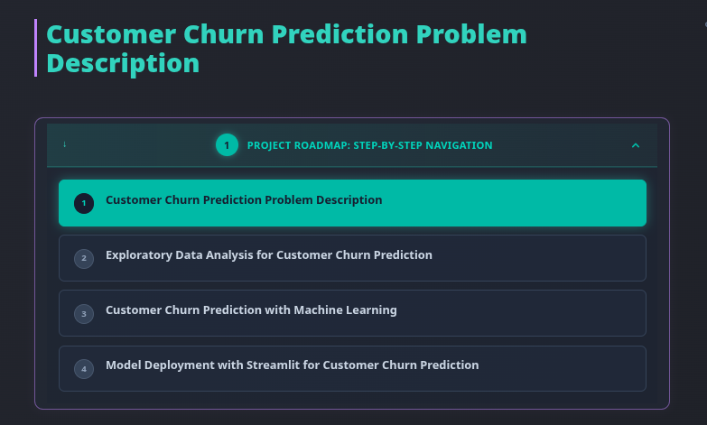
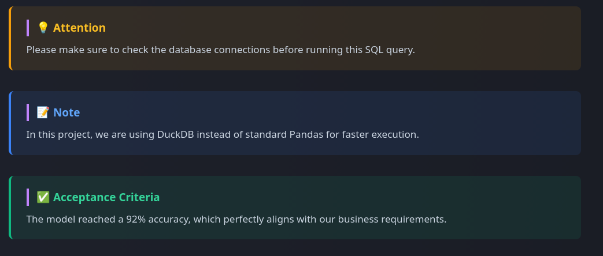
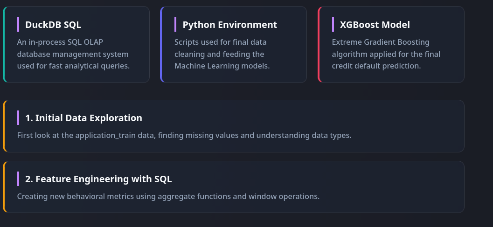
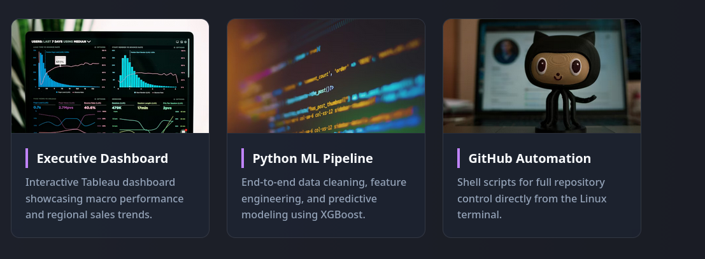
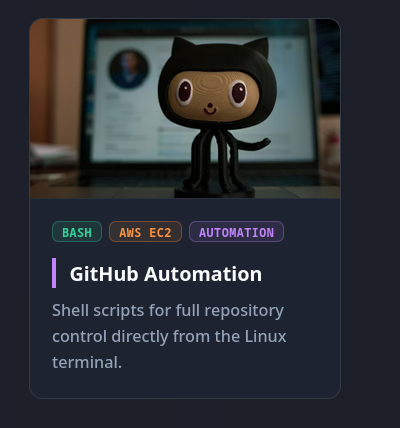
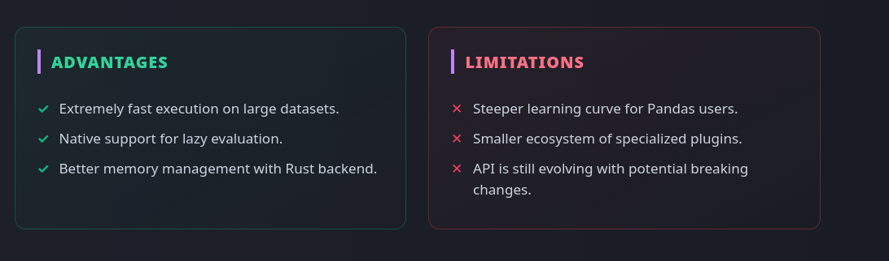
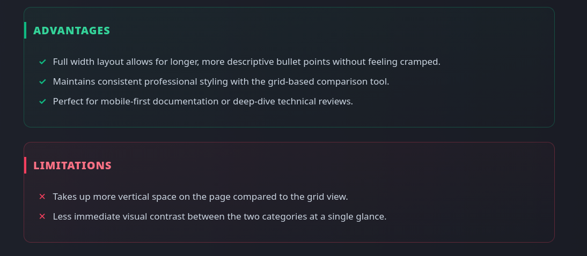
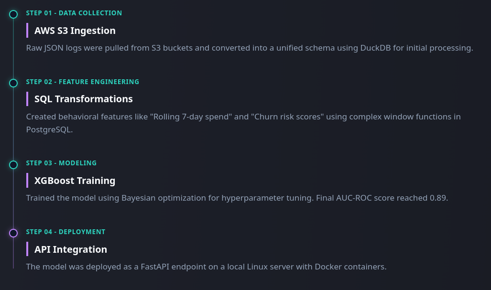
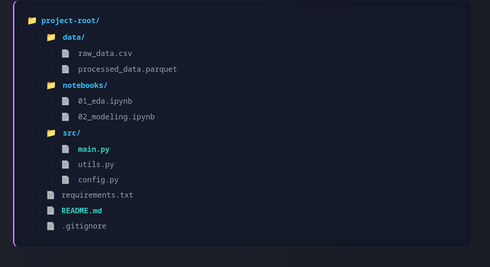
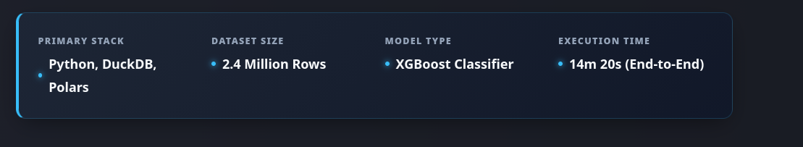

## Procedure

When you write your projects, you may need different stylish components: 

- **Project Cards**: To showcase your projects with beautiful tags and descriptions, you can create project cards that provide a visually appealing way to present your work. 
- **Section Headers**: To organize your content into different sections, you can create stylish section headers that help visitors navigate through your website and find the information they are looking for more easily.
- **Scrollable Tables**: If you have data or information that is best presented in a tabular format, you can create scrollable tables that allow visitors to easily view and interact with the data without overwhelming the page layout.
-  **Toggle Buttons**: This is a great way to hide and show content on your website, especially the long bunch of codes. You can create toggle buttons that allow visitors to expand and collapse sections of content, making it easier for them to navigate through your website and find the information they are looking for without being overwhelmed by too much information at once.
-  **Custom Lists**: To make your lists more visually appealing and engaging, you can create custom list styles that add a unique touch to your content. This can include using different bullet points, icons, or even custom animations to make your lists stand out and capture the attention of your visitors.
-  **Callout Boxes**: To highlight important information or key takeaways, you can create callout boxes that draw attention to specific content on your website. This can be especially useful for emphasizing important points, providing additional context, or showcasing key features of your projects.
-  **Image Galleries**: If you have multiple images related to your projects, you can create image galleries that allow visitors to easily browse through the images in a visually appealing way. This can include features such as lightbox effects, captions, and navigation controls to enhance the user experience when viewing your images.
-  **Timeline Components**: If you want to showcase the timeline of your projects or the progression of your work, you can create timeline components that visually represent the chronological order of events. This can help visitors understand the development process of your projects and provide a clear overview of your work history.
-  **Navigation Menus**: To improve the navigation experience on your website, you can create custom navigation menus that allow visitors to easily access different sections of your website. This can include dropdown menus, sticky navigation bars, or even a sidebar menu to enhance the usability and accessibility of your website.
-  **Interactive Elements**: To make your website more engaging and interactive, you can create various interactive elements such as sliders, tabs, or accordions that allow visitors to interact with your content in a dynamic way. This can help keep visitors engaged and encourage them to explore more of your website.
  
These are not the only components you can create, but they are much more than enough to make your website visually appealing and engaging for your visitors. Everything depends on your needs and preferences, and you can always experiment with different design elements to find what works best for your website. The key is to create a cohesive and visually appealing design that effectively communicates your content and engages your audience.

I will list my preferences that I created for my website, and I will share the CSS codes and shortcodes attached to them. You can use these as a reference or inspiration for your own website design, or you can modify them to fit your specific needs and preferences. The goal is to provide you with ideas and examples that can help you create a visually appealing and engaging website that effectively showcases your projects and content.


## Navigation Menu on the Page

I have built minimalist website for clean and readibility.  Therefore, I have not used navigation sidebar on the left. However, the users must be able to navigate through the projects easily. For example, when they click to `Customer Churn Prediction` project in the top menu, they should be aware of where they are and how to navigate to other steps of the corresponding project.

Because of this reason, I have created a navigation menu on the top of the page that allows users to easily navigate through the different sections of the project.  I added styling to that navigation menu so it is looking professional and fancy.  It looks like this:



In order to build it follow the steps below:

1. Create `src/components/ProjectNavigation.astro` file and add the following code:

<details>
<summary>See Code</summary>

```astro
---
import { getCollection } from 'astro:content';

const { currentId, collectionName } = Astro.props;

// Mevcut sayfanın hangi klasörde olduğunu bul (Örn: home_credit)
const projectFolder = currentId.split('/')[0];

// Aynı koleksiyondaki tüm dosyaları çek
const allEntries = await getCollection(collectionName as any);

// Sadece aynı klasördeki ve 'index' olmayan dosyaları filtrele, numarasına göre diz
const projectSteps = allEntries
  .filter(entry => entry.id.startsWith(projectFolder) && !entry.id.endsWith('index'))
  .sort((a, b) => a.id.localeCompare(b.id));
---

<div class="not-prose mb-12">
  <details class="group border border-teal-500/30 bg-slate-900/40 rounded-xl overflow-hidden shadow-lg">
    <summary class="flex items-center justify-between p-4 cursor-pointer bg-gradient-to-right from-teal-500/10 to-transparent hover:bg-teal-500/20 transition-all">
      <div class="flex items-center gap-3">
        <span class="flex h-8 w-8 items-center justify-center rounded-full bg-teal-500 text-slate-900 font-bold text-sm">
          {projectSteps.findIndex(s => s.id === currentId) + 1}
        </span>
        <span class="text-teal-400 font-bold tracking-wide uppercase text-sm">Project Roadmap: Step-by-Step Navigation</span>
      </div>
      <span class="text-teal-500 group-open:rotate-180 transition-transform duration-300">
        <svg xmlns="http://www.w3.org/2000/svg" class="h-5 w-5" viewBox="0 0 20 20" fill="currentColor">
          <path fill-rule="evenodd" d="M5.293 7.293a1 1 0 011.414 0L10 10.586l3.293-3.293a1 1 0 111.414 1.414l-4 4a1 1 0 01-1.414 0l-4-4a1 1 0 010-1.414z" clip-rule="evenodd" />
        </svg>
      </span>
    </summary>
    
    <div class="p-4 flex flex-col gap-3 bg-slate-900/20">
      {projectSteps.map((step, index) => (
        <a 
          href={`/${collectionName.replace('_', '-')}/${step.id}`}
          class={`flex items-start gap-4 px-5 py-4 rounded-lg border transition-all duration-200
            ${step.id === currentId 
              ? 'bg-teal-500 border-teal-500 text-slate-900 shadow-[0_0_15px_rgba(45,212,191,0.4)]' 
              : 'bg-slate-800/50 border-slate-700 text-slate-300 hover:border-teal-500/50 hover:text-teal-400'}`}
        >
          {/* Numaratör */}
          <span class={`flex-shrink-0 w-7 h-7 flex items-center justify-center rounded-full text-xs font-bold border mt-0.5
            ${step.id === currentId ? 'bg-slate-900 text-teal-400 border-slate-900' : 'bg-slate-700 border-slate-600 text-slate-400'}`}>
            {index + 1}
          </span>
          
          {/* Başlık ve Açıklama (Description) Kısmı */}
          <div class="flex flex-col">
            <span class="font-bold text-base leading-tight">{step.data.title}</span>
            
            {/* Eğer description varsa, altına şık bir şekilde ekle */}
            {step.data.description && (
              <span class={`text-xs mt-1.5 leading-relaxed 
                ${step.id === currentId ? 'text-teal-950 font-medium' : 'text-slate-400'}`}>
                {step.data.description}
              </span>
            )}
          </div>
        </a>
      ))}
    </div>
  </details>
</div>
````
</details>

This code does the following:

- It imports the `getCollection` function from `astro:content` to fetch the content of the current collection.
- It retrieves the `currentId` and `collectionName` from the component's props.
- It determines the current project folder based on the `currentId`.
- It filters the entries in the collection to get only those that belong to the same project folder and are not the `index` file, then sorts them by their ID.
- It renders a collapsible navigation menu using the `<details>` and `<summary>` HTML elements. The menu displays the steps of the project, and highlights the current step.
  
2. In order to see this navigation menu on all projects, you need to add it to ArticleLayout.astro file. Open `src/layouts/ArticleLayout.astro` and add the following code into the frontmatter section:

<details>
<summary>See Code</summary>

```astro
import ProjectNavigation from '../components/ProjectNavigation.astro';
const { frontmatter, headings, currentId, collectionName } = Astro.props;
```
</details>

Then, add the following code right above the <slot /> tag:

<details>
<summary>See Code</summary>

```astro
{currentId && collectionName && !currentId.endsWith('index') && (
  <ProjectNavigation currentId={currentId} collectionName={collectionName} />
)}

<slot />
```

</details>


3. Finally, update the `[...slug].astro` file in your collection to pass the `currentId` and `collectionName` props to the layout. Open `src/content/your_collection/[...slug].astro` and add the following code to the ArticleLayout part:

<details>
<summary>See Code</summary>

```astro
<ArticleLayout 
  frontmatter={entry.data} 
  headings={headings} 
  currentId={entry.id} 
  collectionName="data_analysis"
>
```
</details>

Do this for all slug astro files and run your `npm run dev` command. Now you should see the navigation menu on the top of your project pages, allowing you to easily navigate through the different steps of your projects.


## Stylish "Show Code" Toggle Button

When you have a lot of code in your projects, it can be overwhelming for visitors to see all the code at once. To improve the user experience and make your website more visually appealing, you can create a stylish "Show Code" toggle button that allows visitors to expand and collapse the code sections as needed. This way, visitors can choose to view the code only when they are interested, and it helps to keep the page clean and organized. 

In order to customize the toggle buttons, open `src/styles/global.css` and add the following code to the end of the file:

<details>
<summary>See Code</summary>

```css
/* ═════════════════════════════════════════════════
   "SHOW CODE" BUTTONS (DETAILS & SUMMARY) STYLING
══════════════════════════════════════════════════ */
.prose details {
  background-color: rgba(15, 23, 42, 0.4); /* Çok hafif karanlık arka plan */
  border: 1px solid rgba(45, 212, 191, 0.3); /* Sitemizin o meşhur Turkuaz/Teal rengi */
  border-radius: 0.75rem;
  margin-top: 1.5rem;
  margin-bottom: 1.5rem;
  overflow: hidden;
  box-shadow: 0 4px 6px -1px rgba(0, 0, 0, 0.1);
  transition: border-color 0.3s ease;
}

.prose details:hover {
  border-color: rgba(45, 212, 191, 0.6);
}

.prose summary {
  /* Turkuaz tonlarında havalı bir gradyan arka plan */
  background: linear-gradient(to right, rgba(20, 184, 166, 0.15), rgba(20, 184, 166, 0.05));
  color: #2dd4bf !important; /* Parlak Turkuaz Metin */
  padding: 0.85rem 1.25rem;
  font-weight: 700;
  font-size: 0.95rem;
  letter-spacing: 0.5px;
  cursor: pointer;
  list-style: none; /* Tarayıcının çirkin ok işaretini gizler */
  position: relative;
  transition: all 0.3s ease;
  margin: 0 !important; /* Tailwind prose marginlerini ezer */
}

.prose summary:hover {
  background: linear-gradient(to right, rgba(20, 184, 166, 0.25), rgba(20, 184, 166, 0.1));
  color: #5eead4 !important; /* Üzerine gelince daha da parlar */
}

/* WebKit (Chrome/Safari) varsayılan ok işaretini gizleme */
.prose summary::-webkit-details-marker {
  display: none;
}

/* Kendi Şık Animasyonlu Ok İkoni'muzu Ekliyoruz */
.prose summary::before {
  content: '▶';
  display: inline-block;
  margin-right: 0.75rem;
  font-size: 0.85em;
  transition: transform 0.3s ease;
  color: #2dd4bf;
}

/* Kod bloğu açıldığında okun aşağı dönme animasyonu */
.prose details[open] summary::before {
  transform: rotate(90deg);
}

/* Kod bloğu açıldığında butonun alt çizgisi */
.prose details[open] summary {
  border-bottom: 1px solid rgba(45, 212, 191, 0.2);
}

/* İçerideki kod bloğunun (pre) boşluklarını sıfırlayıp butona tam yapışmasını sağlıyoruz */
.prose details pre {
  margin: 0 !important;
  border-top-left-radius: 0 !important;
  border-top-right-radius: 0 !important;
  border: none !important;
}
```

</details>

This CSS code does the following:  

- It styles the `<details>` element to have a semi-transparent dark background, a teal border, rounded corners, and a subtle shadow. It also adds a hover effect to change the border color.
- It styles the `<summary>` element to have a teal gradient background, bright teal text, padding, and a custom font style. It also removes the default list styling and adds a hover effect to enhance the background and text color.
- It hides the default marker (the small triangle) that appears next to the `<summary>` element in WebKit browsers (like Chrome and Safari).
- It adds a custom arrow icon before the summary text, which rotates when the details are opened to indicate the toggle state.
- It adds a bottom border to the summary when the details are open for better visual separation.
- It ensures that the code block inside the details has no extra margin and is flush with the summary button for a cleaner look.


## Different Callout Boxes

Callout boxes are a great way to highlight important information or key takeaways on your website. They can be used to draw attention to specific content, provide additional context, or showcase key features of your projects. By creating different styles of callout boxes, you can make your content more visually appealing and engaging for your visitors. You can use different colors, icons, and layouts to create a variety of callout boxes that suit the tone and style of your website. 

I have created 5 different callout blocks for my website: `Note` with blue background, `Attention` with yellow background, `Warning` with orange background, `Acceptance` with green background, and `Danger` with red background. 

You can create your own callout boxes by adding the following CSS code to your `global.css` file:

<details>
<summary>See Code</summary>

```css
/* ═════════════════════════════════════════════════
   CALLOUTS (NOTE, ATTENTION, SUCCESS, WARNING, DANGER)
══════════════════════════════════════════════════ */
.prose .callout {
  margin: 2rem 0;
  padding: 1.25rem 1.5rem;
  border-radius: 0.5rem;
  border-left: 4px solid;
  background-color: rgba(30, 41, 59, 0.4); /* Varsayılan Arka Plan */
}

/* Callout Başlığı (İkon + Metin) */
.prose .callout-title {
  font-size: 1.05rem !important;
  font-weight: 700 !important;
  margin-top: 0 !important;
  margin-bottom: 0.5rem !important;
  display: flex;
  align-items: center;
  gap: 0.5rem;
}

/* Callout İçeriği */
.prose .callout p {
  margin-top: 0 !important;
  margin-bottom: 0 !important;
  font-size: 0.95rem;
  line-height: 1.6;
  color: #cbd5e1; /* Slate-300 */
}

/* Birden fazla paragraf varsa aralarını aç */
.prose .callout p + p {
  margin-top: 0.75rem !important;
}

/* 1. NOTE (Mavi) */
.prose .callout.note {
  background-color: rgba(59, 130, 246, 0.1);
  border-left-color: #3b82f6;
}
.prose .callout.note .callout-title { color: #60a5fa !important; }

/* 2. ATTENTION (Sarı) */
.prose .callout.attention {
  background-color: rgba(245, 158, 11, 0.1);
  border-left-color: #f59e0b;
}
.prose .callout.attention .callout-title { color: #fbbf24 !important; }

/* 3. SUCCESS / ACCEPTANCE (Yeşil) */
.prose .callout.success {
  background-color: rgba(16, 185, 129, 0.1);
  border-left-color: #10b981;
}
.prose .callout.success .callout-title { color: #34d399 !important; }

/* 4. WARNING (Turuncu) */
.prose .callout.warning {
  background-color: rgba(249, 115, 22, 0.1);
  border-left-color: #f97316;
}
.prose .callout.warning .callout-title { color: #fb923c !important; }

/* 5. DANGER (Kırmızı) */
.prose .callout.danger {
  background-color: rgba(244, 63, 94, 0.1);
  border-left-color: #f43f5e;
}
.prose .callout.danger .callout-title { color: #fb7185 !important; }
```
</details>


**How to use it in your markdown files?**

You can use the following shortcode (html blocks) in your markdown files to create callout boxes:

<details>
<summary>See Code</summary>

```html
<-- Blue Callout for Notes -->
<div class="callout attention">
<h4 class="callout-title">💡 Attention</h4>
<p>Please make sure to check the database connections before running this SQL query.</p>
</div>

<--- Yellow Callout for Attention -->
<div class="callout note">
<h4 class="callout-title">📝 Note</h4>
<p>In this project, we are using DuckDB instead of standard Pandas for faster execution.</p>
</div>

<-- Green Callout for Success/Acceptance -->
<div class="callout success">
<h4 class="callout-title">✅ Acceptance Criteria</h4>
<p>The model reached a 92% accuracy, which perfectly aligns with our business requirements.</p>
</div>

<-- Orange Callout for Warning -->
<div class="callout warning">
<h4 class="callout-title">⚠️ Warning</h4>
<p>Be cautious when handling missing values, as they can significantly impact the model's performance.</p>
</div>

<-- Red Callout for Danger -->
<div class="callout danger">
<h4 class="callout-title">🚨 Danger</h4>
<p>Do not proceed with this action, as it may lead to data loss or system instability.</p>
</div>
```

</details>

It will look like this on your website:



By using these callout boxes, you can effectively highlight important information and make your content more engaging and visually appealing for your visitors. You can customize the content and styling of the callout boxes to fit the tone and style of your website, and use them strategically to draw attention to key points in your projects.


## Card Views

We can build card views in both side-by-side, row-by-row and gallery style. Card views are a great way to showcase your projects in a visually appealing and organized manner. They allow you to present key information about each project, such as the title, description, and relevant tags, in a compact and easy-to-read format. By using card views, you can make it easier for visitors to quickly scan through your projects and find the ones that interest them the most. You can also add images or icons to the cards to make them more visually engaging and help convey the essence of each project at a glance. 

Add the following CSS code to your `global.css` file to create stylish card views for your projects:

<details>
<summary>See Code</summary>

```css
/* ═════════════════════════════════════════════════
   MARKDOWN IN-PAGE CARDS (GRID & ROW VIEWS)
══════════════════════════════════════════════════ */

/* --- 1. KAPSAYICILAR (CONTAINERS) --- */

/* Yan Yana (Responsive Grid) Görünümü */
.prose .md-grid {
  display: grid;
  /* Sihir burada: Kartlar minimum 250px olur, sığdığı kadar yan yana dizilir. Ekrana göre otomatik 1, 2, 3 veya 4 kolon olur! */
  grid-template-columns: repeat(auto-fill, minmax(250px, 1fr)); 
  gap: 1.25rem;
  margin: 2rem 0;
}

/* Alt Alta (Row) Görünümü */
.prose .md-row {
  display: flex;
  flex-direction: column;
  gap: 1rem;
  margin: 2rem 0;
}

/* --- 2. KARTIN KENDİSİ (BASE CARD) --- */
.prose .md-card {
  display: flex;
  flex-direction: column;
  padding: 1.25rem 1.5rem;
  background-color: rgba(30, 41, 59, 0.4);
  border: 1px solid rgba(255, 255, 255, 0.1);
  border-left: 4px solid #475569; /* Varsayılan Gri Sol Çizgi */
  border-radius: 0.75rem;
  text-decoration: none !important; /* Tailwind'in link alt çizgisini ezer */
  transition: all 0.3s ease;
}

/* Grid Kartları Hover Animasyonu (Yukarı Kalkar) */
.prose .md-grid .md-card:hover {
  transform: translateY(-4px);
  box-shadow: 0 10px 15px -3px rgba(0, 0, 0, 0.2);
}

/* Row Kartları Hover Animasyonu (Sağa Kayar) */
.prose .md-row .md-card:hover {
  transform: translateX(4px);
  box-shadow: 0 4px 6px -1px rgba(0, 0, 0, 0.2);
}

/* Kart İçerikleri */
.prose .md-card-title {
  font-size: 1.1rem !important;
  font-weight: 700 !important;
  margin-top: 0 !important;
  margin-bottom: 0.5rem !important;
  color: #f8fafc !important;
  transition: color 0.3s ease;
}

.prose .md-card-desc {
  font-size: 0.9rem !important;
  line-height: 1.6 !important;
  margin: 0 !important;
  color: #94a3b8 !important;
}

/* --- 3. RENK SEÇENEKLERİ --- */

/* Turkuaz (Teal) */
.prose .md-card.teal { border-left-color: #14b8a6; }
.prose .md-card.teal:hover { border-color: #14b8a6; background-color: rgba(20, 184, 166, 0.05); }
.prose .md-card.teal:hover .md-card-title { color: #2dd4bf !important; }

/* Mavi / İndigo (Linux Tarzı) */
.prose .md-card.indigo { border-left-color: #6366f1; }
.prose .md-card.indigo:hover { border-color: #6366f1; background-color: rgba(99, 102, 241, 0.05); }
.prose .md-card.indigo:hover .md-card-title { color: #818cf8 !important; }

/* Pembe / Gül (ML Tarzı) */
.prose .md-card.rose { border-left-color: #f43f5e; }
.prose .md-card.rose:hover { border-color: #f43f5e; background-color: rgba(244, 63, 94, 0.05); }
.prose .md-card.rose:hover .md-card-title { color: #fb7185 !important; }

/* Sarı / Kehribar (Dikkat Çekici) */
.prose .md-card.amber { border-left-color: #f59e0b; }
.prose .md-card.amber:hover { border-color: #f59e0b; background-color: rgba(245, 158, 11, 0.05); }
.prose .md-card.amber:hover .md-card-title { color: #fbbf24 !important; }
```

</details>

This CSS code creates stylish card views for your projects in both grid and row formats, with different color options for the left border to help differentiate between projects or categories. You can use the following shortcodes in your markdown files to create these card views:

<details>
<summary>See Code</summary>

```html
<--side-by-side grid view-->
 <div class="md-grid">

<a href="https://duckdb.org" target="_blank" class="md-card teal">
<h4 class="md-card-title">DuckDB SQL</h4>
<p class="md-card-desc">An in-process SQL OLAP database management system used for fast analytical queries.</p>
</a>

<a href="https://python.org" target="_blank" class="md-card indigo">
<h4 class="md-card-title">Python Environment</h4>
<p class="md-card-desc">Scripts used for final data cleaning and feeding the Machine Learning models.</p>
</a>

<a href="https://xgboost.ai" target="_blank" class="md-card rose">
<h4 class="md-card-title">XGBoost Model</h4>
<p class="md-card-desc">Extreme Gradient Boosting algorithm applied for the final credit default prediction.</p>
</a>

</div>


<--row-by-row view-->

<div class="md-row">

<a href="/data-analysis/home_credit/01_duckdb_sql_analysis" class="md-card amber">
<h4 class="md-card-title">1. Initial Data Exploration</h4>
<p class="md-card-desc">First look at the application_train data, finding missing values and understanding data types.</p>
</a>

<a href="/data-analysis/home_credit/02_duckdb_feature_engineering" class="md-card amber">
<h4 class="md-card-title">2. Feature Engineering with SQL</h4>
<p class="md-card-desc">Creating new behavioral metrics using aggregate functions and window operations.</p>
</a>

</div>
```
</details>

You can adjust the colors by writing `class="md-card your_color"` in the anchor tag, where `your_color` can be `teal`, `indigo`, `rose`, or `amber`.

It will look like this on your website:



By using these card views, you can effectively showcase your projects in a visually appealing and organized manner, making it easier for visitors to quickly scan through your projects and find the ones that interest them the most. You can customize the content and styling of the cards to fit the tone and style of your website, and use them strategically to highlight key projects or categories in your portfolio.


## Gallery Style Cards

Gallery style cards are a great way to showcase the projects with thumbnail images in a visually appealing and organized manner. You can add colorful tags into the cards to indicate the technologies used in the project, the type of project, or any other relevant information. This can help visitors quickly identify the key aspects of each project and make it easier for them to find projects that match their interests. 

Add the following CSS code to your `global.css` file to create stylish gallery style cards for your projects:

<details>
<summary>See Code</summary> 

```css
/* ═════════════════════════════════════════════════
   MARKDOWN GALLERY CARDS (IMAGE + TEXT VIEW)
══════════════════════════════════════════════════ */

/* Galeri Kapsayıcısı (Grid Yapısı) */
.prose .md-gallery {
  display: grid;
  /* Resimli kartların biraz daha geniş durması iyidir (280px) */
  grid-template-columns: repeat(auto-fill, minmax(280px, 1fr));
  gap: 1.5rem;
  margin: 2rem 0;
}

/* Galeri Kartının Kendisi */
.prose .md-gallery-card {
  display: flex;
  flex-direction: column;
  background-color: rgba(30, 41, 59, 0.4);
  border: 1px solid rgba(255, 255, 255, 0.1);
  border-radius: 0.75rem;
  overflow: hidden; /* Resmin köşelerinin kartla birlikte yuvarlanmasını sağlar */
  text-decoration: none !important;
  transition: all 0.3s ease;
}

/* Hover Efekti (Yukarı Kalkar, Turkuaz Parlar) */
.prose .md-gallery-card:hover {
  transform: translateY(-5px);
  box-shadow: 0 12px 20px -5px rgba(0, 0, 0, 0.3);
  border-color: rgba(45, 212, 191, 0.4);
}

/* Kartın İçindeki Resim */
.prose .md-gallery-img {
  width: 100%;
  height: 180px; /* Tüm resimleri bu yüksekliğe sabitleriz */
  object-fit: cover; /* Resmi sündürmez, boşlukları dolduracak şekilde kırpar */
  border-bottom: 1px solid rgba(255, 255, 255, 0.05);
  margin: 0 !important; /* Tailwind prose marginlerini ezer */
}

/* Kartın İçindeki Metin Alanı (Padding) */
.prose .md-gallery-content {
  padding: 1.25rem;
  display: flex;
  flex-direction: column;
  flex-grow: 1;
}

/* Galeri Başlığı */
.prose .md-gallery-title {
  font-size: 1.1rem !important;
  font-weight: 700 !important;
  margin-top: 0 !important;
  margin-bottom: 0.5rem !important;
  color: #f8fafc !important;
  transition: color 0.3s ease;
}

.prose .md-gallery-card:hover .md-gallery-title {
  color: #2dd4bf !important; /* Üzerine gelince başlık turkuaz olur */
}

/* Galeri Açıklaması */
.prose .md-gallery-desc {
  font-size: 0.9rem !important;
  line-height: 1.6 !important;
  margin: 0 !important;
  color: #94a3b8 !important;
}

```

</details>


You can use the following shortcodes in your markdown files to create these gallery style cards:

<details>
<summary>See Code</summary>

```html
<div class="md-gallery">

<a href="#" class="md-gallery-card">

<div class="md-gallery-content">
<h4 class="md-gallery-title">Executive Dashboard</h4>
<p class="md-gallery-desc">Interactive Tableau dashboard showcasing macro performance and regional sales trends.</p>
</div>
</a>

<a href="#" class="md-gallery-card">

<div class="md-gallery-content">
<h4 class="md-gallery-title">Python ML Pipeline</h4>
<p class="md-gallery-desc">End-to-end data cleaning, feature engineering, and predictive modeling using XGBoost.</p>
</div>
</a>

<a href="#" class="md-gallery-card">

<div class="md-gallery-content">
<h4 class="md-gallery-title">GitHub Automation</h4>
<p class="md-gallery-desc">Shell scripts for full repository control directly from the Linux terminal.</p>
</div>
</a>

</div>
```

</details>

Your example cards will look like this on your website:



You can create colored tags by adding the following CSS code to your `global.css` file:

<details>
<summary>See Code</summary>

```css
/* ═════════════════════════════════════════════════
   MARKDOWN TAGS (BADGES) FOR CARDS & CONTENT
══════════════════════════════════════════════════ */
.prose .md-tags {
  display: flex;
  flex-wrap: wrap;
  gap: 0.4rem;
  margin-bottom: 0.85rem;
}

.prose .md-tag {
  font-size: 0.65rem !important;
  font-weight: 700 !important;
  text-transform: uppercase;
  letter-spacing: 0.5px;
  padding: 0.2rem 0.5rem;
  border-radius: 0.375rem;
  border: 1px solid;
  display: inline-flex;
  align-items: center;
  white-space: nowrap;
  font-family: "Fira Code", monospace !important;
  line-height: 1 !important;
  margin: 0 !important;
}

/* 1. SKY BLUE (Python, Tableau, PostgreSQL, Quarto) */
.prose .md-tag.tag-python, .prose .md-tag.tag-tableau, .prose .md-tag.tag-postgresql, .prose .md-tag.tag-quarto, .prose .md-tag.tag-blue {
  background-color: rgba(56, 189, 248, 0.1); border-color: rgba(56, 189, 248, 0.3); color: #38bdf8 !important;
}

/* 2. TEAL (SQL, T-SQL, PL/SQL, Apache Superset) */
.prose .md-tag.tag-sql, .prose .md-tag.tag-tsql, .prose .md-tag.tag-plsql, .prose .md-tag.tag-superset, .prose .md-tag.tag-teal {
  background-color: rgba(45, 212, 191, 0.1); border-color: rgba(45, 212, 191, 0.3); color: #2dd4bf !important;
}

/* 3. INDIGO (R, Statistics, Hypothesis Testing, A/B Testing) */
.prose .md-tag.tag-r, .prose .md-tag.tag-stats, .prose .md-tag.tag-hypothesis, .prose .md-tag.tag-ab-testing, .prose .md-tag.tag-indigo {
  background-color: rgba(129, 140, 248, 0.1); border-color: rgba(129, 140, 248, 0.3); color: #818cf8 !important;
}

/* 4. ROSE / PINK (Machine Learning, Predictive Analysis) */
.prose .md-tag.tag-ml, .prose .md-tag.tag-predictive, .prose .md-tag.tag-rose {
  background-color: rgba(251, 113, 133, 0.1); border-color: rgba(251, 113, 133, 0.3); color: #fb7185 !important;
}

/* 5. VIOLET / PURPLE (Deep Learning, Neural Networks, Astro) */
.prose .md-tag.tag-dl, .prose .md-tag.tag-nn, .prose .md-tag.tag-astro, .prose .md-tag.tag-purple {
  background-color: rgba(192, 132, 252, 0.1); border-color: rgba(192, 132, 252, 0.3); color: #c084fc !important;
}

/* 6. AMBER / YELLOW (Data Analysis, EDA, Power BI) */
.prose .md-tag.tag-da, .prose .md-tag.tag-eda, .prose .md-tag.tag-powerbi, .prose .md-tag.tag-amber {
  background-color: rgba(251, 191, 36, 0.1); border-color: rgba(251, 191, 36, 0.3); color: #fbbf24 !important;
}

/* 7. ORANGE (AWS Ecosystem, Rust, Jupyter) */
.prose .md-tag.tag-aws, .prose .md-tag.tag-aws-s3, .prose .md-tag.tag-aws-iam, .prose .md-tag.tag-aws-ec2, .prose .md-tag.tag-sagemaker, .prose .md-tag.tag-rust, .prose .md-tag.tag-jupyter, .prose .md-tag.tag-orange {
  background-color: rgba(251, 146, 60, 0.1); border-color: rgba(251, 146, 60, 0.3); color: #fb923c !important;
}

/* 8. EMERALD / GREEN (Bash, MongoDB, Docker) */
.prose .md-tag.tag-bash, .prose .md-tag.tag-mongodb, .prose .md-tag.tag-docker, .prose .md-tag.tag-green {
  background-color: rgba(52, 211, 153, 0.1); border-color: rgba(52, 211, 153, 0.3); color: #34d399 !important;
}

/* 9. CYAN (Go, Snowflake, MySQL) */
.prose .md-tag.tag-go, .prose .md-tag.tag-snowflake, .prose .md-tag.tag-mysql, .prose .md-tag.tag-cyan {
  background-color: rgba(34, 211, 238, 0.1); border-color: rgba(34, 211, 238, 0.3); color: #22d3ee !important;
}

/* 10. RED (Databricks, Oracle SQL) */
.prose .md-tag.tag-databricks, .prose .md-tag.tag-oracle, .prose .md-tag.tag-red {
  background-color: rgba(248, 113, 113, 0.1); border-color: rgba(248, 113, 113, 0.3); color: #f87171 !important;
}
```

</details>

You can add tags to your gallery cards by including a div with the class `md-tags` inside the card content, and then adding individual tags with the class `md-tag` and a specific tag class for color. Here's how you can do it in your markdown files:

<details>
<summary>See Code</summary>

```html

<!-- Gallery Card with Tags -->
<div class="md-gallery">

<a href="#" class="md-gallery-card">

<div class="md-gallery-content">
<div class="md-tags">
<span class="md-tag tag-bash">Bash</span>
<span class="md-tag tag-aws">AWS EC2</span>
<span class="md-tag tag-purple">Automation</span>
</div>
<h4 class="md-gallery-title">GitHub Automation</h4>
<p class="md-gallery-desc">Shell scripts for full repository control directly from the Linux terminal.</p>
</div>
</a>

</div>

<!-- Row Card with Tags -->

<div class="md-grid">

<a href="#" class="md-card teal">
<div class="md-tags">
<span class="md-tag tag-python">Python</span>
<span class="md-tag tag-sql">DuckDB SQL</span>
<span class="md-tag tag-eda">EDA</span>
</div>
<h4 class="md-card-title">Home Credit Default Risk</h4>
<p class="md-card-desc">Advanced risk analysis utilizing DuckDB for SQL-based feature engineering.</p>
</a>

</div>
``` 

</details>

It will look like the following:




## Scrollable Tables

When you have tables with a lot of columns, it can break the layout of your page and make it difficult for visitors to read the content. To solve this issue, you can create scrollable tables that allow visitors to scroll horizontally to view all the columns without affecting the overall layout of the page. This way, you can maintain a clean and organized design while still providing access to all the information in your tables.

Add the following CSS code to your `global.css` file to create stylish scrollable tables for your projects:

<details>
<summary>See Code</summary>

```css
/* ═════════════════════════════════════════════════
   PREMIUM SCROLLABLE TABLES (STICKY HEADER & LILAC NEON)
══════════════════════════════════════════════════ */

/* 1. Kapsayıcı (Wrapper) Kutumuz: Hafif Lila Neon ve Scroll */
.scrollable-table {
  width: 100%;
  max-height: 500px;
  overflow-y: auto;
  overflow-x: auto;
  margin: 2.5rem 0;
  background-color: rgba(15, 23, 42, 0.4); /* Koyu Arka Plan */
  border: 1px solid rgba(192, 132, 252, 0.3); /* Zarif Lila Çizgi */
  border-radius: 0.75rem;
  
  /* Hafif Neon Efekti: Lila tonlarında iç içe gölge */
  box-shadow: 0 0 15px rgba(192, 132, 252, 0.08), 0 0 5px rgba(192, 132, 252, 0.03);
  transition: box-shadow 0.3s ease, border-color 0.3s ease;
}

/* Üzerine gelince neon efekti biraz daha canlansın */
.scrollable-table:hover {
  box-shadow: 0 0 20px rgba(192, 132, 252, 0.15), 0 0 10px rgba(192, 132, 252, 0.08);
  border-color: rgba(192, 132, 252, 0.6);
}

/* Tablo Kaydırma Çubuğu (Lila Uyumlu) */
.scrollable-table::-webkit-scrollbar { width: 6px; height: 6px; }
.scrollable-table::-webkit-scrollbar-track { background: transparent; }
.scrollable-table::-webkit-scrollbar-thumb { background-color: rgba(192, 132, 252, 0.3); border-radius: 10px; }
.scrollable-table:hover::-webkit-scrollbar-thumb { background-color: rgba(192, 132, 252, 0.6); }

/* 2. Tablonun Kendisi */
.scrollable-table table, .prose .scrollable-table table {
  width: 100%;
  min-width: 600px; 
  border-collapse: separate; 
  border-spacing: 0;
  white-space: nowrap;
  margin: 0 !important;
}

/* 3. Sticky Başlıklar (Headers) */
.scrollable-table th {
  position: sticky;
  top: 0;
  z-index: 10;
  
  background-color: #0f172a; 
  color: #c084fc !important; /* Sicak Lila Metin */
  font-size: 0.85rem !important;
  font-weight: 700 !important;
  text-transform: uppercase;
  letter-spacing: 0.05em;
  padding: 1.25rem;
  text-align: left;
  
  /* Alt çizgi efekti lila tonunda */
  box-shadow: inset 0 -2px 0 rgba(192, 132, 252, 0.4);
}

/* 4. Hücreler (Cells) ve Satırlar */
.scrollable-table td {
  padding: 1rem 1.25rem;
  color: #cbd5e1;
  border-bottom: 1px solid rgba(255, 255, 255, 0.05); 
  font-size: 0.9rem;
}

.scrollable-table tr:last-child td {
  border-bottom: none; 
}

/* Satır Hover Efekti (Farenin olduğu satır lila parlar) */
.scrollable-table tbody tr {
  transition: background-color 0.2s ease;
}
.scrollable-table tbody tr:hover td {
  background-color: rgba(192, 132, 252, 0.08); /* Okumayı kolaylaştıran şık lila focus efekti */
}

/* =========================================================
   Düz (Wrapper'sız) Markdown Tabloları İçin Yedek (Fallback)
========================================================== */
.prose table:not(.scrollable-table table) {
  width: 100%;
  display: block;
  overflow-x: auto;
  border-collapse: collapse;
  margin: 2rem 0;
}
.prose table:not(.scrollable-table table) th, .prose table:not(.scrollable-table table) td {
  border: 1px solid #374151;
  padding: 0.75rem;
}
```
</details>

You can create scrollable tables in your markdown files by wrapping your table in a div with the class `scrollable-table`. Here's how you can do it:

<details>
<summary>See Code</summary>

```html
<div class="scrollable-table">
| Column 1 | Column 2 | Column 3 | Column 4 | Column 5 | Column 6 |
|----------|----------|----------|----------|----------|----------|
| Data 1   | Data 2   | Data 3   | Data 4   | Data 5   | Data 6   |
| Data 7   | Data 8   | Data 9   | Data 10  | Data 11  | Data 12  |
| Data 13  | Data 14  | Data 15  | Data 16  | Data 17  | Data 18  |
</div>
```
</details>

You can either write the table in markdown format and wrap it with the div, or you can write the entire table in HTML format inside the div. Both will work as long as the table is inside a div with the class `scrollable-table`.


## Comparison Blocks

In articles, projects, or case studies where you want to compare two or more items, such as tools, techniques, or approaches, you can create comparison blocks. These blocks allow you to present the pros and cons of each item side by side or row by row, making it easier for readers to understand the differences and make informed decisions. By using comparison blocks, you can effectively highlight the strengths and weaknesses of each option, providing valuable insights for your audience.

Add the following CSS code to your `global.css` file to create stylish comparison blocks for your projects:

<details>
<summary>See Code</summary>

```css
/* ═════════════════════════════════════════════════
   TECHNICAL COMPARISON BOXES (PROS & CONS)
══════════════════════════════════════════════════ */

/* Ana Kapsayıcı: Responsive Grid */
.prose .md-comparison {
  display: grid;
  grid-template-columns: repeat(auto-fit, minmax(300px, 1fr));
  gap: 1.5rem;
  margin: 2.5rem 0;
}

/* Ortak Kutu Yapısı */
.prose .comp-box {
  padding: 1.5rem;
  border-radius: 0.75rem;
  border: 1px solid;
  background-color: rgba(30, 41, 59, 0.3);
  display: flex;
  flex-direction: column;
}

/* Başlık Stilleri */
.prose .comp-box h4 {
  display: flex;
  align-items: center;
  gap: 0.5rem;
  font-size: 1.1rem !important;
  font-weight: 800 !important;
  text-transform: uppercase;
  letter-spacing: 0.05em;
  margin-top: 0 !important;
  margin-bottom: 1rem !important;
}

/* Liste Stilleri */
.prose .comp-box ul {
  list-style: none !important;
  padding-left: 0 !important;
  margin: 0 !important;
}

.prose .comp-box li {
  position: relative;
  padding-left: 1.5rem !important;
  margin-bottom: 0.5rem !important;
  font-size: 0.95rem;
  line-height: 1.5;
  color: #cbd5e1;
}

/* Liste İkonları (Custom Bullets) */
.prose .comp-box li::before {
  position: absolute;
  left: 0;
  font-weight: bold;
}

/* --- RENK GRUPLARI --- */

/* ADVANTAGES (Yeşilimsi) */
.prose .comp-box.pros {
  border-color: rgba(16, 185, 129, 0.3);
  background: linear-gradient(to bottom right, rgba(16, 185, 129, 0.05), transparent);
}
.prose .comp-box.pros h4 { color: #34d399 !important; }
.prose .comp-box.pros li::before { content: '✓'; color: #10b981; }

/* DISADVANTAGES (Kırmızımsı) */
.prose .comp-box.cons {
  border-color: rgba(244, 63, 94, 0.3);
  background: linear-gradient(to bottom right, rgba(244, 63, 94, 0.05), transparent);
}
.prose .comp-box.cons h4 { color: #fb7185 !important; }
.prose .comp-box.cons li::before { content: '✕'; color: #f43f5e; }
```

</details>

You can create comparison blocks in your markdown files by using divs with the classes `comp-box pros` for advantages and `comp-box cons` for disadvantages. Here's how you can do it:

<details>
<summary>See Code</summary>

```html
<div class="md-comparison">

<div class="comp-box pros">
<h4>Advantages</h4>
<ul>
<li>Extremely fast execution on large datasets.</li>
<li>Native support for lazy evaluation.</li>
<li>Better memory management with Rust backend.</li>
</ul>
</div>

<div class="comp-box cons">
<h4>Limitations</h4>
<ul>
<li>Steeper learning curve for Pandas users.</li>
<li>Smaller ecosystem of specialized plugins.</li>
<li>API is still evolving with potential breaking changes.</li>
</ul>
</div>

</div>
```

</details>

The comparison blocks will look like this on your website:




**Row-by-row comparison:**

In order to create a row-by-row comparison instead of side-by-side, you can simply stack the comparison boxes vertically without using the grid layout. Here's how you can do it. Add the following CSS code to your `global.css` file:


<details>
<summary>See Code</summary>

```css
/* ═════════════════════════════════════════════════
   TECHNICAL COMPARISON - ROW VIEW EXTENSION
══════════════════════════════════════════════════ */

/* Row Kapsayıcısı: Kartları tam genişlikte alt alta dizer */
.prose .md-comparison-row {
  display: flex;
  flex-direction: column;
  gap: 1.5rem;
  margin: 2.5rem 0;
}

/* Row görünümünde kartların tam genişlik almasını sağlıyoruz */
.prose .md-comparison-row .comp-box {
  width: 100%;
}

/* Row modunda başlıkların yanındaki o şık lila çizgiyi koruyoruz */
.prose .md-comparison-row .comp-box h4 {
  border-left: 4px solid;
  padding-left: 0.75rem;
  margin-left: -1.5rem; /* Padding'i dengelemek için */
}

/* Başlık çizgisi renkleri */
.prose .md-comparison-row .comp-box.pros h4 { border-left-color: #10b981; }
.prose .md-comparison-row .comp-box.cons h4 { border-left-color: #f43f5e; }
```

</details>

You can then use the following shortcodes in your markdown files to create row-by-row comparison blocks:

<details>
<summary>See Code</summary>

```html
<div class="md-comparison-row">

<div class="comp-box pros">
<h4>Advantages</h4>
<ul>
<li>Full width layout allows for longer, more descriptive bullet points without feeling cramped.</li>
<li>Maintains consistent professional styling with the grid-based comparison tool.</li>
<li>Perfect for mobile-first documentation or deep-dive technical reviews.</li>
</ul>
</div>

<div class="comp-box cons">
<h4>Limitations</h4>
<ul>
<li>Takes up more vertical space on the page compared to the grid view.</li>
<li>Less immediate visual contrast between the two categories at a single glance.</li>
</ul>
</div>

</div>
```

</details>

Row-by-row comparison blocks will look like this on your website:




## Timeline

Timeline blocks are effective for showcasing the chronological progression of a project, highlighting key milestones, or illustrating the evolution of a concept over time. By using timeline blocks, you can visually represent the sequence of events, making it easier for readers to understand the development process and the relationships between different stages of a project. This can be particularly useful in case studies, project retrospectives, or any content where the order of events is important for comprehension.

Add the following CSS code to your `global.css` file to create stylish timeline blocks for your projects:

<details>
<summary>See Code</summary>

```css
/* ═════════════════════════════════════════════════
   TECHNICAL PROJECT TIMELINE (VERTICAL)
══════════════════════════════════════════════════ */

.prose .md-timeline {
  position: relative;
  margin: 3rem 0;
  padding-left: 2rem; /* Çizgi için yer açıyoruz */
}

/* Dikey Ana Çizgi */
.prose .md-timeline::before {
  content: '';
  position: absolute;
  left: 0.45rem;
  top: 0.5rem;
  bottom: 0.5rem;
  width: 2px;
  background: linear-gradient(to bottom, #2dd4bf, #c084fc); /* Turkuazdan Lilaya geçiş */
  opacity: 0.3;
}

/* Her Bir Adım */
.prose .timeline-step {
  position: relative;
  margin-bottom: 2.5rem;
}

.prose .timeline-step:last-child {
  margin-bottom: 0;
}

/* Adım Noktası (Dot) */
.prose .timeline-step::before {
  content: '';
  position: absolute;
  left: -2rem; /* Çizginin üzerine tam otursun */
  top: 0.35rem;
  width: 1rem;
  height: 1rem;
  background-color: #0f172a;
  border: 2px solid #2dd4bf;
  border-radius: 50%;
  z-index: 2;
  box-shadow: 0 0 10px rgba(45, 212, 191, 0.4);
}

/* Son adımın noktası lila olsun (Bitiş vurgusu) */
.prose .timeline-step:last-child::before {
  border-color: #c084fc;
  box-shadow: 0 0 10px rgba(192, 132, 252, 0.4);
}

/* İçerik Kutusu */
.prose .timeline-content {
  display: flex;
  flex-direction: column;
}

.prose .timeline-content h4 {
  margin-top: 0 !important;
  margin-bottom: 0.4rem !important;
  color: #f8fafc !important;
  font-size: 1.1rem !important;
  font-weight: 700 !important;
}

.prose .timeline-content .step-date {
  font-size: 0.75rem;
  font-weight: 700;
  text-transform: uppercase;
  letter-spacing: 0.05em;
  color: #2dd4bf; /* Tarihler turkuaz parlasın */
  margin-bottom: 0.5rem;
}

.prose .timeline-content p {
  margin: 0 !important;
  color: #94a3b8 !important;
  font-size: 0.95rem;
  line-height: 1.6;
}
```

</details>

You can create timeline blocks in your markdown files by using divs with the class `md-timeline` for the container and `timeline-step` for each step in the timeline. Here's how you can do it:

<details>
<summary>See Code</summary>

```html
<div class="md-timeline">

<div class="timeline-step">
<div class="timeline-content">
<span class="step-date">Step 01 - Data Collection</span>
<h4>AWS S3 Ingestion</h4>
<p>Raw JSON logs were pulled from S3 buckets and converted into a unified schema using DuckDB for initial processing.</p>
</div>
</div>

<div class="timeline-step">
<div class="timeline-content">
<span class="step-date">Step 02 - Feature Engineering</span>
<h4>SQL Transformations</h4>
<p>Created behavioral features like "Rolling 7-day spend" and "Churn risk scores" using complex window functions in PostgreSQL.</p>
</div>
</div>

<div class="timeline-step">
<div class="timeline-content">
<span class="step-date">Step 03 - Modeling</span>
<h4>XGBoost Training</h4>
<p>Trained the model using Bayesian optimization for hyperparameter tuning. Final AUC-ROC score reached 0.89.</p>
</div>
</div>

<div class="timeline-step">
<div class="timeline-content">
<span class="step-date">Step 04 - Deployment</span>
<h4>API Integration</h4>
<p>The model was deployed as a FastAPI endpoint on a local Linux server with Docker containers.</p>
</div>
</div>

</div>
```

</details>

Your timeline will look like this on your website:



## Interactive File Tree

Instead of just listing your project files in a static format, you can create an interactive file tree that allows visitors to expand and collapse folders to explore the structure of your project. This can be particularly useful for showcasing complex projects with multiple directories and files, as it provides a clear visual representation of how the project is organized. By using an interactive file tree, you can make it easier for visitors to navigate through your project and find specific files or sections that they are interested in.

Add the following CSS code to your `global.css` file to create a stylish interactive file tree for your projects:

<details>
<summary>See Code</summary>

```css
/* ═════════════════════════════════════════════════
   TECHNICAL FILE TREE STRUCTURE
══════════════════════════════════════════════════ */

.prose .file-tree {
  background-color: rgba(15, 23, 42, 0.6);
  border: 1px solid rgba(148, 163, 184, 0.1);
  border-left: 3px solid #c084fc; /* Lila yan çizgi */
  border-radius: 0.75rem;
  padding: 1.5rem;
  margin: 2rem 0;
  font-family: 'Fira Code', 'Cascadia Code', monospace;
  font-size: 0.9rem;
  color: #cbd5e1;
  box-shadow: inset 0 0 20px rgba(0, 0, 0, 0.2);
}

/* Klasör Stili */
.prose .file-tree .folder {
  color: #38bdf8; /* Klasörler Gök Mavisi */
  font-weight: 700;
  display: flex;
  align-items: center;
  gap: 0.5rem;
  margin-bottom: 0.25rem;
}

.prose .file-tree .folder::before {
  content: '📁';
  font-size: 1rem;
}

/* Dosya Stili */
.prose .file-tree .file {
  color: #94a3b8; /* Dosyalar Gri */
  display: flex;
  align-items: center;
  gap: 0.5rem;
  margin-bottom: 0.25rem;
}

.prose .file-tree .file::before {
  content: '📄';
  font-size: 0.9rem;
  opacity: 0.7;
}

/* İçerideki dosyalar için girinti (Indentation) */
.prose .file-tree .indent-1 { margin-left: 1.5rem; border-left: 1px solid rgba(255,255,255,0.05); padding-left: 0.5rem; }
.prose .file-tree .indent-2 { margin-left: 3rem; border-left: 1px solid rgba(255,255,255,0.05); padding-left: 0.5rem; }
.prose .file-tree .indent-3 { margin-left: 4.5rem; border-left: 1px solid rgba(255,255,255,0.05); padding-left: 0.5rem; }

/* Özel Dosya Vurgusu (Örn: main.py veya .env) */
.prose .file-tree .file.active {
  color: #2dd4bf; /* Önemli dosyalar Turkuaz */
  font-weight: 600;
}
```

</details>


You can create an interactive file tree in your markdown files by using divs with the class `file-tree` for the container, and then using nested divs with classes `folder` and `file` to represent folders and files respectively. Here's how you can do it:

<details>
<summary>See Code</summary>

```html
<div class="file-tree">

<div class="folder">project-root/</div>
<div class="folder indent-1">data/</div>
<div class="file indent-2">raw_data.csv</div>
<div class="file indent-2">processed_data.parquet</div>

<div class="folder indent-1">notebooks/</div>
<div class="file indent-2">01_eda.ipynb</div>
<div class="file indent-2">02_modeling.ipynb</div>

<div class="folder indent-1">src/</div>
<div class="file indent-2 active">main.py</div>
<div class="file indent-2">utils.py</div>
<div class="file indent-2">config.py</div>

<div class="file indent-1">requirements.txt</div>
<div class="file indent-1 active">README.md</div>
<div class="file indent-1">.gitignore</div>

</div>
```

</details>

Your interactive file tree will look like this on your website:



## Quick Glance Stats

When you want to highlight key statistics, metrics, or performance indicators related to your project, you can create "Quick Glance Stats" blocks. These blocks allow you to present important numbers in a visually appealing way, making it easy for readers to quickly grasp the significance of the data. By using Quick Glance Stats, you can effectively communicate the impact and results of your project, drawing attention to the most critical information without overwhelming your audience with too much detail.

Add the following CSS code to your `global.css` file to create stylish Quick Glance Stats blocks for your projects:

<details>
<summary>See Code</summary>

```css
/* ═════════════════════════════════════════════════
   TECH QUICK GLANCE (PROJECT SPEC SUMMARY)
══════════════════════════════════════════════════ */

.prose .tech-glance {
  background: linear-gradient(135deg, rgba(30, 41, 59, 0.7) 0%, rgba(15, 23, 42, 0.8) 100%);
  border: 1px solid rgba(56, 189, 248, 0.2);
  border-left: 4px solid #38bdf8; /* Gök Mavisi Vurgu */
  border-radius: 0.75rem;
  padding: 1.5rem;
  margin: 2rem 0;
  display: grid;
  grid-template-columns: repeat(auto-fit, minmax(200px, 1fr));
  gap: 1.5rem;
  box-shadow: 0 10px 30px -10px rgba(0, 0, 0, 0.5);
}

.prose .glance-item {
  display: flex;
  flex-direction: column;
  gap: 0.25rem;
}

/* Etiket (Label) */
.prose .glance-label {
  font-size: 0.7rem;
  font-weight: 800;
  text-transform: uppercase;
  letter-spacing: 0.1em;
  color: #94a3b8; /* Soft Gri */
}

/* Değer (Value) */
.prose .glance-value {
  font-size: 1rem;
  font-weight: 600;
  color: #f8fafc;
  display: flex;
  align-items: center;
  gap: 0.5rem;
}

/* Değerlerin yanına opsiyonel küçük bir dot ekleyelim */
.prose .glance-value::before {
  content: '';
  width: 6px;
  height: 6px;
  background-color: #38bdf8;
  border-radius: 50%;
  display: inline-block;
  box-shadow: 0 0 8px #38bdf8;
}
```

</details>

You can create Quick Glance Stats blocks in your markdown files by using a div with the class `tech-glance` for the container, and then using nested divs with classes `glance-item`, `glance-label`, and `glance-value` to represent each statistic. Here's how you can do it:

<details>
<summary>See Code</summary>

```html
<div class="tech-glance">

<div class="glance-item">
<span class="glance-label">Primary Stack</span>
<span class="glance-value">Python, DuckDB, Polars</span>
</div>

<div class="glance-item">
<span class="glance-label">Dataset Size</span>
<span class="glance-value">2.4 Million Rows</span>
</div>

<div class="glance-item">
<span class="glance-label">Model Type</span>
<span class="glance-value">XGBoost Classifier</span>
</div>

<div class="glance-item">
<span class="glance-label">Execution Time</span>
<span class="glance-value">14m 20s (End-to-End)</span>
</div>

</div>

```

</details>

Your Quick Glance Stats block will look like this on your website:




These are just very few examples of the types of shortcodes you can create to enhance the design and functionality of your website. You can customize these shortcodes further by adding more styles, animations, or interactivity using JavaScript if needed. The key is to create reusable components that can be easily included in your markdown files to maintain a consistent and professional look across your entire website.

## What's Next?

Now that you have a solid foundation of custom shortcodes to enhance your technical project showcases, you can start implementing them in your existing and future projects. Here are some next steps you can take:

1. **Integrate Shortcodes into Existing Projects**: Go through your current project pages and identify where you can replace static content with the new shortcodes. This will not only improve the visual appeal but also make your content more engaging and easier to navigate.
2. **Create New Projects with Shortcodes**: For any new projects you work on, plan to use these shortcodes from the start. This will help you maintain a consistent style across all your projects and make it easier to create visually appealing content.
3. **Expand Your Shortcode Library**: As you continue to build your website, you may find new opportunities to create additional shortcodes for other types of content, such as code snippets, interactive charts, or even custom call-to-action buttons. Keep experimenting and adding to your library of shortcodes to further enhance your website's functionality and design.
4. **Gather Feedback**: Share your updated website with peers, mentors, or your professional network and gather feedback on the new design elements. This can help you identify any areas for improvement and ensure that your website effectively communicates the value of your projects to your audience.
5. **Optimize for Performance**: As you add more custom styles and components, make sure to optimize your website for performance. This includes minimizing CSS and JavaScript files, optimizing images, and ensuring that your website loads quickly for visitors.
6. **Document Your Shortcodes**: Consider creating a documentation page on your website that explains how to use each shortcode, along with examples. This can be helpful for future reference and for anyone else who may want to contribute to your website or use your shortcodes in their own projects.
7. **Keep Your Content Updated**: Regularly update your project pages with new insights, results, or improvements. This will keep your website fresh and demonstrate that you are actively engaged in your work. By continuously refining your content and design, you can create a compelling online portfolio that effectively showcases your skills and attracts potential employers or collaborators.

By following these steps, you can ensure that your website remains a dynamic and effective platform for showcasing your technical projects, while also providing a great user experience for your visitors.


